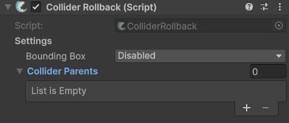

# ColliderRollback (Pro Feature)

## Description

This component is used for rolling back colliders on objects for the purpose of lag compensation. You can find out more about it in the dedicated guide for this feature: [raycast.md](../../guides/features/lag-compensation/raycast.md "mention")

## Settings

<figure><figcaption>
Default settings
</figcaption></figure>

### :gear:  **Bounding Box**

> This configures how a bounding box is added to the object. When set to **Disabled** a bounding box will not be added. Additional settings are displayed when not set to **Disabled**.

### :gear:  **Physics Type**

> This is which type of physics you plan on rolling back, and determines if a Physics collider is added, or Physics2D collider.

### :gear:  **Bounding Box Size**

> This determines how large of a bounding box to add. Typically a value three times larger than the world space of your object is sufficient. For example, if your object is a Vector3.one cube, this value would Vector3(3f, 3f, 3f). If an object is exceptionally fast moving consider making this larger.

### :gear:  **Collider Parents**

> These are transforms you wish to send back in time when performing a rollback. For best results put your hitboxes on their own transform, which is a child of the object the hitbox is for. A setup example is rovided as a demo within `FishNet\Demos\ColliderRollback`.
