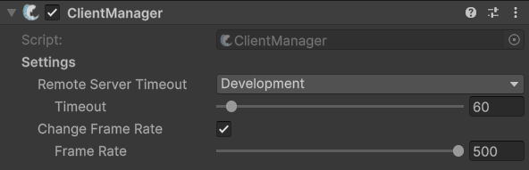

# ClientManager

## Description 

The **ClientManager** is FishNet's primary orchestrator for client-side networking, managing connections, state, event handling, and all data flow between the local client and the server.

It maintains a reference to the network connection of the local client, `Connection`, keeps track of all known networked objects on the client through `ClientObjects`, as well as optionally tracks all currently connected clients (when [server ID sharing](server-manager.md#share-ids) is enabled), using a dictionary of client connections. The ClientManager also has many useful events, such as when a client is authenticated and when the local client or a remote client changes their network state. It also is used for sending [broadcasts](../../../guides/features/network-communication/broadcasts.md) to the server.

When enabled, this component will also timeout the client from the server if the server doesn't respond after a set time.&#x20;


Check out its API page for more specific methods and events [here](https://fish-networking.com/FishNet/api/api/FishNet.Managing.Client.ClientManager.html).


## Settings 

<figure><figcaption>
Default Settings
</figcaption></figure>

### :gear:  **Remote Server Timeout**

> This decides if the client should disconnect when the server seems unresponsive. This feature can be set to **disabled**, work in **development** and releases, or only **releases**.
>
> * **Timeout** is how long the server must be unresponsive before they are kicked.

### :gear:  **Change Frame Rate**

> While enabled, this will change the frame rate limitation when acting as client only.
>
> * **Frame Rate** is the frame rate to use while only the client is active. There is also a setting for client frame rate on the [ServerManager](server-manager.md). When both client and server are active the higher of the two frame rates will be used.
