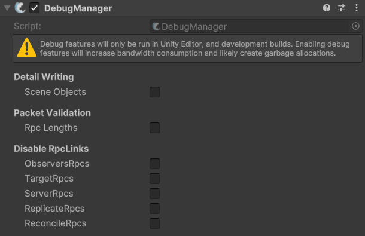

# DebugManager

## Description 

The **Debug Manager** component can be used to gain extra information and temporarily tweak certain networking aspects to assist in debugging errors in your game. For example, if you are running into Scene ID errors you can enable the Detailed Writing of Scene Objects to know the object names instead of just IDs. These settings often come at the cost of a little more bandwidth used and are only enabled in the Editor and Development builds of your game.

## Settings 

<figure><figcaption>
Default settings
</figcaption></figure>

### :gear: **Scene Objects**

> This adds information about scene objects instead of just sending IDs. You can use this when debugging missing sceneId / spawn-related issues.

### :gear: **RPC Lengths**

> This will validate written versus read length of RPCs when enabled. Use in development to detect serialization mismatches in RPCs (written length vs read length).

### :gear: **ObserversRpcs**

> This disables ObserverRpc links.

### :gear: **TargetRpcs**

> This disables TargetRpc links.

### :gear: **ServerRpcs**

> This disables ServerRpcs links.

### :gear: **ReplicateRpcs**

> This disables ReplicateRpc links.

### :gear: **ReconcileRpcs**

> This disables ReconcileRpc links.
