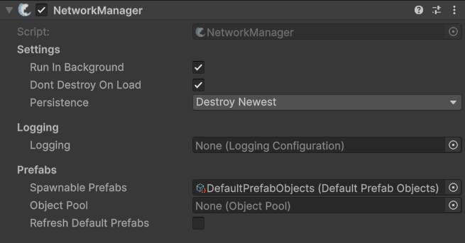

# NetworkManager

## Description

The **NetworkManager** is the central component of FishNet that manages the networking lifecycle, including establishing connections, hosting sessions, and handling client-server communication. Although this component manages the network, it should not itself be a networked object, and must not contain a [Network Object](../network-object.md) component on the same object, or as a parent or child of it.  Additionally, the Network Manager can be used to register components and access them directly from it. This can be useful for other manager like scripts.

The Network Manager utilizes several sub-manager components, which it will add at runtime if they do not already exist on the object.


Check out its API page for more specific methods and events [here](https://fish-networking.com/FishNet/api/api/FishNet.Managing.NetworkManager.html).


## Settings 

<figure><figcaption>
Default Settings
</figcaption></figure>

### :gear:  **Run In Background**

> This allows the application to run in the background when true. Running in the background is often essential for clients, and especially for the server.

### :gear:  **Don't Destroy On Load**

> This will ensure the Network Manager persist between scene changes. If you are using only one Network Manager it's best to leave this true.

### :gear:  **Persistence**

> This option specifies how to behave when multiple NetworkManagers exist in your game.

### :gear:  **Logging**

> This lets you specify what actions to log for builds, editor, and headless mode. When the field is not populated, the default logging settings are used. To make a custom logging settings open your create menu and choose: **Tools > Fish-Networking > Logging > Logging Configuration.**

### :gear:  **Spawnable Prefabs**

> This option dictates which prefabs collection to use for networked objects. By default this field is automatically set to DefaultPrefabObjects for any saved scene; you can however make your own PrefabObjects class with customized rules and applications.

### :gear:  **Object Pool**

> Which object pooling script to use. When not set, DefaultObjectPool is added automatically at run-time. You may inherit from ObjectPool to create your own.

### :gear:  **Refresh Default Prefabs**

> While true, this will refresh the DefaultPrefabCollection every time play mode is entered. This is generally not needed to be enabled, but can be useful if your prefab collection is regularly becoming corrupted through symlinks.
