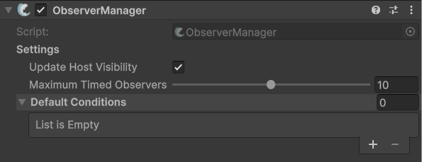

# ObserverManager

## Description 

**ObserverManager** is used to globally customize the observer system. Observer conditions within the ObserverManager will be automatically added to [NetworkObjects](../../../../guides/features/networked-gameobjects-and-scripts/networkobjects/), unless the [NetworkObserver](../../network-observer.md) component is set to ignore the manager.


Check out its API page for more specific methods and events [here](https://fish-networking.com/FishNet/api/api/FishNet.Managing.Observing.ObserverManager.html).


## Settings 

<figure><figcaption>
Default Settings
</figcaption></figure>

### :gear:  **Update Host Visibility**

> This will hide renderers on networked objects which are hidden to host client. When true, all networked objects will be visible to the host client even if these objects would normally be despawned for the client.

### :gear:  **Maximum Timed Observers**

> The maximum duration that the server will take to update timed observer conditions as server load increases. Lower values will result in timed conditions being checked quicker at the cost of performance.

### :gear:  **Default Conditions**

> These are [Observer Conditions](../../../scriptableobjects/observerconditions/) which will be added to all NetworkObjects by default.
>
> Almost all games should utilize at least the [Scene Observer Condition](../../../scriptableobjects/observerconditions/scenecondition.md).
