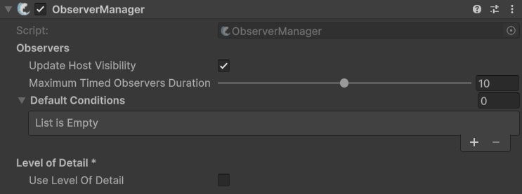

# ObserverManager

## Description 

**ObserverManager** is used to globally customize the observer system. Observer conditions within the ObserverManager will be automatically added to [NetworkObjects](../../../../guides/features/networked-gameobjects-and-scripts/networkobjects/), unless the [NetworkObserver](../../network-observer.md) component is set to ignore the manager.


Check out its API page for more specific methods and events [here](https://fish-networking.com/FishNet/api/api/FishNet.Managing.Observing.ObserverManager.html).


## Settings 

<figure><figcaption>
Default settings
</figcaption></figure>

### :gear: **Update Host Visibility**

> This will hide renderers on networked objects which are hidden to host client. When true, all networked objects will be visible to the host client even if these objects would normally be despawned for the client.

### :gear: **Maximum Timed Observers Duration**

> The maximum duration that the server will take to update timed observer conditions as server load increases. Lower values will result in timed conditions being checked quicker at the cost of performance.

### :gear: **Default Conditions**

> These are [Observer Conditions](../../../scriptableobjects/observerconditions/) which will be added to all NetworkObjects by default.
>
> Almost all games should utilize at least the [Scene Observer Condition](../../../scriptableobjects/observerconditions/scenecondition.md).

### :gear: Use **Level of Detail**

> This will enable the [LOD system](../../../../guides/features/level-of-detail.md) and show the options for configuring it. It requires [FishNet Pro](../../../../guides/updating-fishnet/upgrading-to-fishnet-pro.md).

### :gear: Maximum Send Interval

> The upper limit for how long (in seconds) the system will wait between updates for objects in the furthest LOD bracket. If set to `5`, the most distant objects will only receive updates once every 5 seconds.

### :gear: Recalculation Duration

> This determines how quickly (in seconds) the server cycles through objects to update their current LOD status.
>
> This value scales automatically if the server's frame rate is capped. Lower values are generally more ideal to ensure objects transition between LOD brackets responsively.
>
> Use `SetLevelOfDetailRecalculationDuration(float duration)` if you want to adjust this value at run-time.

### :gear: **Level of Detail Distances**

> This is a list of distance thresholds. Each entry defines a "bracket" for synchronization frequency.
>
> _Example:_ If you have two distances set to `5` and `15`, FishNet will run with the following setup:
>
> * Near (< 5 units): Objects sync at the standard, full-speed interval.
> * Mid (5 to 14.9 units): Objects sync at a reduced "mid-tier" frequency.
> * Far (≥ 15 units): Objects sync at the maximum allowed delay.
>
> The system uses an **exponential scaling** method to determine how often updates are sent for each distance bracket. This ensures a smooth transition between high-frequency updates for nearby objects and low-frequency updates for distant ones.
