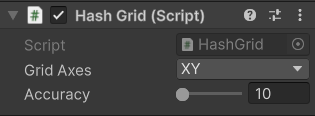

# HashGrid

## Description

The **HashGrid** is required when using the [Grid Condition](../../network-observer.md). This component is responsible for managing the grid and providing information to grid objects. While grids are less accurate than using the [Distance Condition](../../../scriptableobjects/observerconditions/distancecondition.md) they do provide better performance. HashGrid must be placed on or beneath the [NetworkManager ](../network-manager.md)object.

## Settings

<figure><figcaption>
Default settings
</figcaption></figure>

### :gear: **Grid Axes**

> These are which axes to base the grid on. Whichever axis is excluded will not have it's values considered in calculations. For example, if you are developing a 2D game most likely only XY matters, so you would choose the XY axes.

### :gear: **Accuracy**

> This determines how close a client's [FirstObject](https://fish-networking.com/FishNet/api/api/FishNet.Connection.NetworkConnection.html#FishNet_Connection_NetworkConnection_FirstObject) must be (in Unity units) to be considered in range. Note that accuracy is not as precise as when using a [Distance Condition](../../../scriptableobjects/observerconditions/distancecondition.md).
