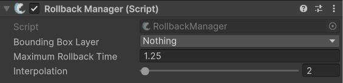

# RollbackManager (Pro Feature)

## Description 

The RollbackManager must be added and configured properly for lag compensation to function properly. Objects you wish to rollback must contain the[ ColliderRollback](../colliderrollback.md) script on them. You can learn more about using it on this page: [lag-compensation](../../../guides/features/lag-compensation/ "mention")


Check out its API page for more specific methods [here](https://fish-networking.com/FishNet/api/api/FishNet.Component.ColliderRollback.RollbackManager.html).


## Settings 

<figure><figcaption>
Default settings
</figcaption></figure>

### :gear: **Bounding Box Layer**

> This is the layer to first test against before rolling back colliders. When a layer is specified a collider will be added to your [ColliderRollback](../colliderrollback.md) objects; because of this, be sure to use a layer which has no physics intersections and is not used for anything else.

### :gear: **Maximum Rollback Time**

> This is the maximum of seconds colliders may rollback. Using a value of 1f would allow colliders to rollback at most one second in the past, which is a very reasonable amount of time given typical player latencies are less than 100ms.

### :gear: **Interpolation**

> This is the amount of interpolation you are using on your [NetworkTransform](../network-transform.md) components. Or if you are using rigidbodies with prediction this would be the **interpolation** value on the smoothing component.
