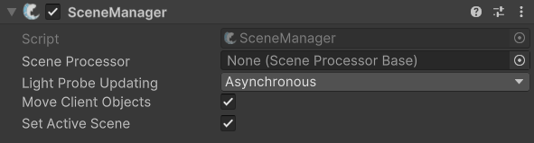

# SceneManager

## Description 

FishNet’s **SceneManager** provides robust, synchronized, and event-driven scene management for networked Unity games, ensuring all clients and the server remain in sync throughout complex scene operations. It is responsible for coordinating which scenes are loaded or unloaded across all clients and the server, ensuring synchronization and exposes many options for the loading of scenes. There are multiple guides that are worth reading about it: [scene-management](../../../guides/features/scene-management/ "mention")

The callbacks within the SceneManager are informative and quite useful, well worth looking into!


Check out its API page for more specific methods and events [here](https://firstgeargames.com/FishNet/api/api/FishNet.Managing.Scened.SceneManager.html).


## Settings 

<figure><figcaption>
Default Settings
</figcaption></figure>

### :gear:  **Scene Processor**

> This determines how scene loads occur. When left empty the default scene processor is used. For more information on scene processing and addressables see [here.](../../../guides/features/scene-management/custom-scene-processors/addressables.md)

### :gear:  **Light Probe Updating**

> This controls how light probes are updated after scenes are loaded.

### :gear:  **Move Client Host Objects**

> When enabled this will move objects visible to the host client to a temporary scene rather than let them be destroyed when a scene is unloaded. Objects are then destroyed next tick by the host client. This ensures that server and client side callbacks will work properly on the moved objects.

### :gear:  **Set Active Scene**

> This will allow the **SceneManager** to pick which scene to set as the active scene when loading and unloading scenes. By default global scenes are used, and if no global scenes then the clients single scene.
