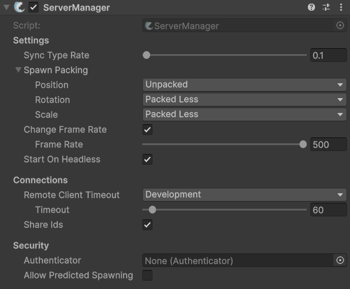

# ServerManager

## Description 

The **ServerManager** is a central component responsible for handling server-related data and actions. It maintains information and handles operations for server-side networked objects as well as tracking connected clients, both authenticated and unauthenticated. Additionally, it monitors client timeouts and disconnects unresponsive clients.

The **ServerManager** can be used directly to start and stop the FishNet server as well as monitor its state and send [broadcasts](../../../guides/features/network-communication/broadcasts.md) to the clients.


Check out its API page for more specific methods and events [here](https://fish-networking.com/FishNet/api/api/FishNet.Managing.Server.ServerManager.html).


## Settings 

<figure><figcaption>
Default settings
</figcaption></figure>

### :gear: **SyncType Rate**

> This is the default send rate for [SyncTypes](../../../guides/features/network-communication/synchronizing/). Setting it to 0 will send updates every tick. This value can be overridden for individual SyncTypes.

### :gear: **Spawn Packing**

> This determines how well transform properties will be packed[^1] when being sent in a spawn message. If transforms spawn marginally off reducing the packing may help.
>
> These can be edited for **Position**, **Rotation** and **Scale** independently.

### :gear: **Change Frame Rate**

> When enabled, this will change the frame rate limitation when acting as server only.
>
> * **Frame Rate** is the frame rate to use while only the server is active. There is also a setting for client frame rate on the [ClientManager](clientmanager.md). When both server and client are active the higher of the two frame rates will be used.

### :gear: **Start On Headless**

> When this is enabled, FishNet will automatically start the server when loaded on a server (headless) build.

### :gear: **Remote Client Timeout**

> This decides if the server should disconnect clients which seem unresponsive. This feature can be set to disabled, work in development and releases, or only releases.
>
> * **Timeout** is how long the client must be unresponsive before they are kicked.

### :gear: **Share Ids**

> While true, this enables clients to be aware of other clients in-game and objects owned by other clients. Objects owned by other clients are only known if they are available to the local client, such as through the observer system. Client Ids are not sensitive information but leaving this option enabled will use slightly additional bandwidth.

### :gear: **Authenticator**

> This is where you can specify which [authenticator](../utilities/authenticator.md) to use. When left empty clients may join the server without specialized authentication.

### :gear: **Allow Predicted Spawning**

> This option lets prefabs and scene objects be setup to use [Predicted Spawning](../../../guides/features/networked-gameobjects-and-scripts/spawning/predicted-spawning.md). You can use this setting to enable or disable predicted spawning without having to change the settings for every object. This value may also be set at runtime. If changing at runtime be certain to also change on the client; otherwise they could be kicked for trying to use a disabled feature.
>
> * **Reserved Object Ids** is the number of ObjectIds to reserve per client for predicted spawning. Clients will start out with the specified number of Ids and receive new ones as the server validates their predicted spawning requests. For example: if this value was set to 15 and a client with a 100ms ping sent 3 predicted spawns in one tick then they would have only 12 predicted spawns left to use until the server responded with 3 new Ids, which would be approximately 50ms later.

[^1]: compressed together to save bandwidth
