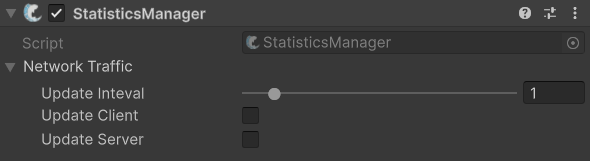

# StatisticsManager

## Description 

The **Statistics Manager** component is responsible for tracking and reporting network traffic statistics for your multiplayer game. Its **Network Traffic** can be used to gain basic information about how much network traffic your game is using. These values must be enabled for the [BandwidthDisplay](../utilities/bandwidthdisplay.md) component to function.


Check out its API page for more specific methods and events [here](https://firstgeargames.com/FishNet/api/api/FishNet.Managing.Statistic.StatisticsManager.html).


## Settings 

<figure><figcaption>
Default Settings
</figcaption></figure>

### :gear:  **Update Interval**

> This is how often network traffic related operations occur, such as invoking update events.

### :gear:  **Update Client**

> This will invoke client traffic updates when enabled.

### :gear:  **Update Server**

> This will invoke server traffic updates when enabled.
