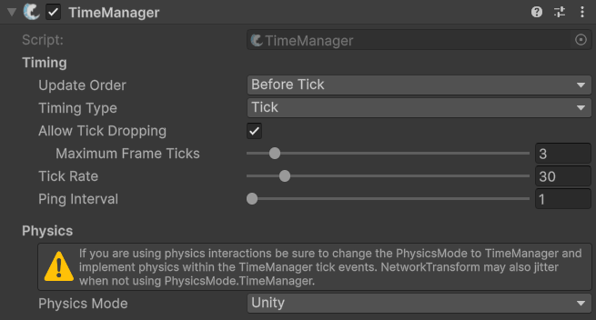

# TimeManager

## Description 

The **TimeManager** component is responsible for managing network time and tick-based systems within the networking framework. It is central to keeping networked objects synchronized in time, handling ticks, timing conversions, physics step control, and providing hooks for network-related timing events in FishNet. It does this by managing how network timing is performed, either using fixed ticks or variable intervals and by providing precise timing for sending and receiving network data, ensuring synchronization between server and clients. It also controls the physics simulation mode (manual, automatic, or disabled) to maintain consistent simulation across the network.


Check out its API page for more specific methods and events [here](https://fish-networking.com/FishNet/api/api/FishNet.Managing.Timing.TimeManager.html).


## Settings 

<figure><figcaption>
Default Settings
</figcaption></figure>

### :gear:  **Update Order**

> Controls when the TimeManager will invoke its version of Unity callbacks. BeforeTick would be a good option if you wanted to collect input in OnUpdate before the tick occurred.

### :gear:  **Timing Type**

> Dictates when data is sent and read. When set to Tick data is only processed on frames which also tick. When Variable is selected data will be sent and read every frame, when available.

### :gear:  **Allow Tick Dropping**

> Will let the client skip ticks when they occur several times over a single frame. This can be useful to prevent the client from running an increasing number of simulations per frame, resulting in more performance loss.

### :gear:  **Maximum Frame Ticks**

> This is shown when **Allow Tick Dropping** is enabled. This value is the maximum number of ticks that can occur per frame before the client begins dropping ticks to recover performance.

### :gear:  **Tick Rate**

> This is an average of how many times per second the TimeManager will invoke tick events, as well how often data may be sent or received.

### :gear:  **Ping Interval**

> How often, in seconds, a user receives a ping update. A larger ping has a very small chance of server tick synchronization losing accuracy. These changes do not affect prediction.

### :gear:  **Timing Interval**

> This is how many seconds between prediction timing updates. Lower values will result in marginally more accurate timings at the cost of bandwidth.

### :gear:  **Physics Mode**

> The Physics Mode determines how physics are run. **Unity** will let the engine manage physics. **TimeManager** simulates physics on ticks. When using Client-Side Prediction you must use the **TimeManager** setting.
