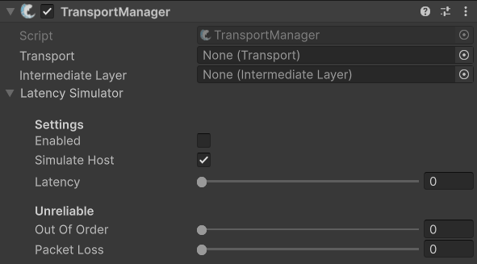

# TransportManager

## Description

The **TransportManager** in FishNet is a central component responsible for communicating with the underlying network transport to send and receive data. It acts as the bridge between FishNet’s networking system and the actual transport layer, enabling networked games to send/receive packets to and from clients and servers. There is also support for latency simulation for testing different network conditions.

With the TransportManager you can optionally utilize an intermediate layer to modify data before it’s sent or after it’s received (e.g., encryption, compression).

If you want to modify network data such as for encryption, or use any one of our number of transports, you will want to add this component to your [NetworkManager](../network-manager.md) game object.


Check out its API page for more specific methods and events [here](https://fish-networking.com/FishNet/api/api/FishNet.Managing.Transporting.TransportManager.html).


## Settings

<figure><figcaption>
Default Settings
</figcaption></figure>

### :gear: **Transport**

> This field indicates which [transport](../../../../guides/high-level-overview/transports.md) to use. When left empty, the default transport ([Tugboat](../../../transports/tugboat.md)) is used, or the first transport manually added to the object which the TransportManager resides.

### :gear: **Intermediate Layer**

> This is used to specify a custom [intermediate layer](intermediatelayer.md) to use.

### :gear: Latency Simulator

> These settings allow you to simulate a variety of latency scenarios on any transport.
>
> * **Enabled:** Toggles the enabled state of the simulator.
> * **Simulate Host:** When enabled, this will also simulate latency for host client.
> * **Latency:** Is the amount of latency to simulate in milliseconds.
> * **Unreliable:** Features only used for unreliable packets.
>   * **Out Of Order:** The percentage chance to send an out of order packet.
>   * **Packet Loss:** The chance to drop a packet.
