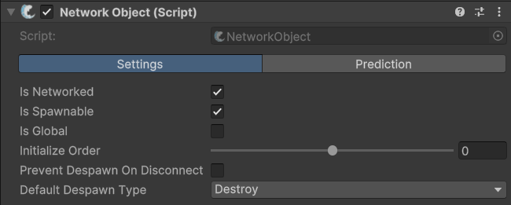
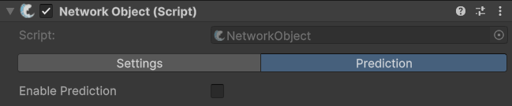

# NetworkObject

## Description

The **NetworkObject** component is essential for any game object that needs to be synchronized or controlled over the network using FishNet. It acts as the anchor for all [networked behaviors](../../guides/features/networked-gameobjects-and-scripts/network-behaviour-guides.md) and manages [identification](../../guides/features/server-and-client-identification/), [ownership](../../guides/features/ownership/), and the object's lifecycle within the networking system.

You can nest network objects, place them in scenes, or in prefabs, but the component itself cannot be added to a game object at run-time.


Check out the API page for more specific methods, properties, and events [here](https://fish-networking.com/FishNet/api/api/FishNet.Object.NetworkObject.html).


## Settings




<figure><figcaption>
Default settings in the <strong>Settings</strong> tab
</figcaption></figure>

:gear: **Is Networked**

> Indicates if an object should always be considered a networked object. When false the object will not initialize as networked. This may be useful if you have objects that you sometimes want to only run locally, and other times spawn over the network. Anytime an object is spawned using [ServerManager.Spawn](../../guides/features/networked-gameobjects-and-scripts/spawning/) _Is Networked_ automatically becomes true for that instantiated copy.

:gear: **Is Spawnable**

> This should be enabled if the object can spawn at runtime; this is generally false for scene prefabs as you do not need to instantiate and manually spawn them. While true, this object's prefab will be added to [DefaultPrefabObjects](../scriptableobjects/spawnableprefabs/defaultprefabobjects.md).

:gear: **Is Global**

> When enabled, this will make the **NetworkObject** known to all clients at all times, the object will also be added to the [Don't Destroy on Load](https://docs.unity3d.com/ScriptReference/Object.DontDestroyOnLoad.html) scene. This setting will have **no** effect on [scene objects](../../guides/high-level-overview/terminology/miscellaneous.md#scene-object), but for instantiated objects it may be set in the prefab or changed at run-time immediately after instantiating the object.

:gear: **Initialize Order**

> Determines the order in which **NetworkObjects** spawned in the same tick will run their [initialization callbacks](../../guides/features/networked-gameobjects-and-scripts/network-behaviour-guides.md#callbacks). A lower value will have higher priority and execute first. The default value is 0 and negative values are allowed.

:gear: **Prevent Despawn On Disconnect**

> This will ensure the object will not be destroyed or despawned when the owning client disconnects.

:gear: **Default Despawn Type**

> This is the default behavior when despawning the object. Objects are typically destroyed when despawned, but this can be set to other values, such as _Pool_, to save performance.
>
> Check out the [object-pooling.md](../../guides/features/networked-gameobjects-and-scripts/spawning/object-pooling.md "mention")guide for more information.




<figure><figcaption>
Default settings in the <strong>Prediction</strong> tab
</figcaption></figure>

:gear: **Enable Prediction**

> This should be used to set whether the object is making use of [prediction](../../guides/features/prediction/what-is-client-side-prediction.md) or not. Enabling this will make available the following settings:

:gear: **Prediction Type**

> You can use this to set if you are using rigidbodies or not for the predicted object. For example, if you were updating your transform with a CharacterController component this would be set to _Other_. If you were using rigidbodies you would choose _Rigidbody_ or _Rigidbody2D_.

:gear: **Enable State Forwarding**

> This is used to forward the replicate and reconcile states to all clients. This is ideal for games where you want all clients and server to run the same inputs. Disabling this setting will cause prediction to only be used on the owner; you will then have to synchronize to spectators using other means, such as a [NetworkTransform](network-transform.md) or custom script.

:gear: **Graphical Object**

> This is the object which holds the graphics for your predicted object. When using client-side prediction all predicted objects must have their graphics as a child of the predicted object. For example, if your rigidbody and collider are on the root object, the graphics must remain beneath the root and set as the graphical object.

:gear: **Detach Graphical Object**

> When **true**, this will detach and re-attach the graphical object at runtime when the client initializes/de-initializes the item. This can resolve camera jitter or be helpful objects child of the graphical which do not handle reconiliation well, such as certain animation rigs. Transform is detached after [OnStartClient](../../guides/features/networked-gameobjects-and-scripts/network-behaviour-guides.md#onstartclient), and reattached before [OnStopClient](../../guides/features/networked-gameobjects-and-scripts/network-behaviour-guides.md#onstopclient).

:gear: **Interpolation**

> Is how many ticks to interpolate the graphics on client owned objects. A setting as low as 1 can usually be sufficient to smooth over the frames between ticks.

:gear: **Enable Teleport**

> This will allow the graphical object to teleport to it's actual position – also known as the root position – if the position changes are drastic. Ideally you will not need this setting, but it's an available option should you desire to use it.

:gear: **Teleport Threshold**

> This is shown while teleporting is enabled. If the graphical object's position is this many units away from the actual position, then the graphical object will teleport to the actual position.


