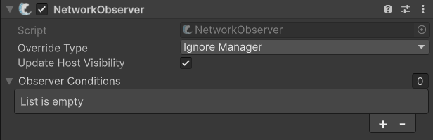

# NetworkObserver

## Description 

The **NetworkObserver** uses conditions to determine if a client qualifies to be an observer of an object; any number of conditions may be used and a client will be considered an observer of the object if he passes all active conditions. The NetworkObserver component can be used to override the [ObserverManager](managers/observermanager/), or add additional conditions onto the object to which the NetworkObserver is added.


When adding this component manually, be careful not to unintentionally override the default scene observer condition of the object by using the **Ignore Manager** override type setting.


This component will be added to a network object at run-time if it doesn't already exist.


Check out the API page for specific methods, and properties [here](https://fish-networking.com/FishNet/api/api/FishNet.Observing.NetworkObserver.html).


## Conditions 

There are [several included conditions](../scriptableobjects/observerconditions/), which may be used together. ObserverCondition may also be inherited from [to make your own conditions](../../guides/features/observers/custom-conditions.md). When all conditions are true, the object will become visible to the client.

Each condition must be created as a scriptable object, and dropped into the Network Observer component.

## Settings 

<figure><figcaption>
Default Settings
</figcaption></figure>

### :gear: **Override Type**

> This is used to change how the **NetworkObserver** component uses the [ObserverManager](managers/observermanager/) settings. _Add Missing_ will add any conditions from the ObserverManager which are not already on the NetworkObserver. _UseManager_ replaces conditions with those from the manager. _Ignore Manager_ will keep the NetworkObserver conditions, ignoring the ObserverManager entirely.
>
> _Add Missing_ is usually the recommended option.

### :gear: **Update Host Visibility**

> This will change the visibility of renderers for the host client when server objects are not visible to the client. If you wish to enable and disable other aspects during a visibility change consider using the [`NetworkObject.OnHostVisibilityUpdated`](https://fish-networking.com/FishNet/api/api/FishNet.Object.NetworkObject.html#FishNet_Object_NetworkObject_OnHostVisibilityUpdated) event.

### :gear: **Observer Conditions**

> This is a list of which observer conditions to use. You can find out more about the specific ones here: [observerconditions](../scriptableobjects/observerconditions/ "mention")
