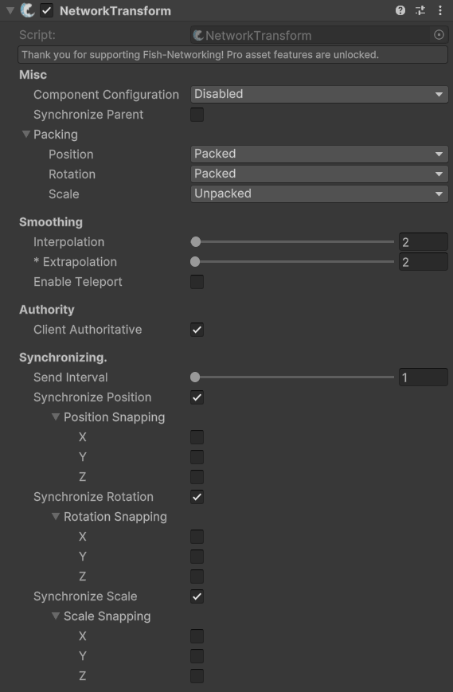

# NetworkTransform

## Description 

NetworkTransform is FishNet’s robust solution for syncing transform data (position, rotation, scale) over the network, supporting both server and client authority, smooth movement, and scene hierarchy handling. It is essential for multiplayer games where objects need to appear at the same place for all players.

You may place as many NetworkTransforms as you like on children. A single NetworkTransform will synchronize the object it is directly on.


Check out the [moving-your-player-around.md](../../tutorials/getting-started/moving-your-player-around.md "mention") guide for an example of using the **Network Transform** to sync basic player movement.



Check out the API page for more specific methods, properties, and events [here](https://fish-networking.com/FishNet/api/api/FishNet.Component.Transforming.NetworkTransform.html).


## Settings 

<figure><figcaption>
Default Settings
</figcaption></figure>

### :gear:  **Component Configuration**

> The **Component Configuration** attempts to automatically configure components used to move your object. For example, if you were to use a CharacterController you could change this setting to **CharacterController** and the CharacterController will be automatically configured based on other **NetworkTransform** settings. This feature does not change owner smoothing; for example, if you are using a client authoritative rigidbody setting the Component Configuration to rigidbody will not interpolate the rigidbody for owner, but rather configures the rigidbody on non-owners and server so the NetworkTransform can smooth it properly.

### :gear:  **Synchronize Parents**

> When enabled, this will automatically synchronize which objects the transform is attached to.

### :gear:  **Packing**

> These settings determine the level of packing for each transform property. In some instances you may want more precision; **Unpacked** will give you the most precisio&#x6E;**, Packed** will give you the least amount of precision, and **Packed Less** will give you an in-between amount. Less packing equals more precision at the cost of more network bandwidth used.

### :gear:  Interpolation

> This is how long of a buffer to create when replicating the transform. Larger interpolation values will reduce the chance of jitter should there be network lag in favor of the transform being further in the past.

### :gear:  **Extrapolation (pro feature)**

> This is how long the transform will try to predict movement when new data is expected, but does not arrive. Using a low interpolation value mixed with extrapolation is a great way to get responsive movement without showing network latency.

### :gear:  **Enable Teleport**

> This option allows the **NetworkTransform** to teleport the object instead of smoothly moving it over several frames once the distance moved in an instance is greater than the set threshold.

### :gear:  **Teleport Threshold**

> This is how far the transform must travel in a single update to cause a teleport rather than smoothing. Using a value of 0f will teleport every frame and will result in no smoothing at all.

### :gear:  **Client Authoritative**

> &#x20;as true allows the owning client to make changes to their transform locally, and those changes will be sent to the server and other clients. While false the server must change transforms to have them sent to clients.

### :gear:  **Send Interval**

> &#x20;determines at most how often in ticks the NetworkTransform may send. A value of 1 indicates the NetworkTransform can send every tick, if there is change. A value of 5 would mean that the NetworkTransform will send at most every 5 ticks, even if there is change between each tick. For example: if using an interval of 5 and the transform changes and sends on tick 100, then changes on 101, the next update will not send until 105.

### :gear:  **Synchronize Position, Rotation, Scale**

> The **Synchronize** settings let you choose which properties to synchronize. Only changed values will send over the network, but if you do not want a value to update at all you can turn off synchronization for a transform property. The **Snapping** settings will allow the transform to snap axes rather than smooth them over time. This feature is commonly used for 2D games, such if you wanted to flip the Y axis on rotation immediately.
