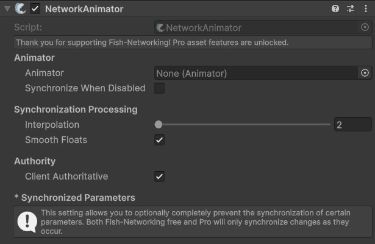

# NetworkAnimator

## Description

FishNet's **Network Animator** is a component designed to synchronize Unity’s Animator state and parameters over the network. It supports both server-authoritative and client-authoritative modes. In client authority mode, the owner client can send animation parameter changes to the server, which then relays them to other clients.


This component does not align with our Client-Side prediction API. You may still use the NetworkAnimator with prediction but the animations likely be updated slightly before the prediction state runs.


You may place as many NetworkAnimators as you like on children or root. When an animator is not specified on the Animator field the first one on the same object is used.


Check out the API page for specific methods, and properties [here](https://fish-networking.com/FishNet/api/api/FishNet.Component.Animating.NetworkAnimator.html).


## Settings <a href="#server-and-host" id="server-and-host"></a>

<div align="left"><figure><figcaption><p>Default Settings</p></figcaption></figure></div>

### :gear:  **Animator**

> This field indicates which Animator to synchronize over the network. The referenced animator can be anywhere on the object. You may also change the Animator at runtime using Network Animator API.

### :gear:  **Synchronize When Disabled**

> When enabled, this will allow the **NetworkAnimator** to synchronize changes even when the **Animator** component is disabled.

### :gear:  **Interpolation**

> This is how many ticks of interpolation to use. Like the [NetworkTransform](network-transform.md), the animator will be this number of ticks behind before iterating data. To use tick alignment with a NetworkTransform, use the same value of interpolation as on the NetworkTransform.

### :gear:  **Smooth Floats**

> This will ensure floats are moved over time on those receiving animator updates. This is commonly left true to allow blending between animation trees.

### :gear:  **Client Authoritative**

> When this is enabled it allows the owning client to make changes to their animations locally, and those changes will be sent to the server and other clients. While disabled the server must change animations to have them sent to clients.

### :gear:  **Send To Owner**

> This will only be displayed when _**Client Authoritative**_ is false. While _**Synchronize To Owner**_ is true the server will also send animation changes to the object owner; while false the owner will not get the animation changes by the server. This can be useful if you want to run animations locally in real time on owning clients.

### :gear:  **Synchronized Parameters (pro feature)**

> These allow only specified parameters to be synchronized over the network. This can be useful if some parameters should only be used for the local client, or do not necessarily need to be networked.

## Runtime

The NetworkAnimator will detect values, layer weights, and speed changes automatically, and synchronize these changes efficiently.

However, most projects also depend on using crossfade, play, and other common Animator APIs.

To synchronize these actions over the network you will simply call each desired method on your NetworkAnimator reference.

```csharp
//This will perform Play on your animator, and synchronize the
//action over the network.
_myNetworkAnimator.Play(stringOrHash);
```

There are several more common methods in our NetworkAnimator component that you will want to use. To see all methods you're encouraged to view our [API](https://fish-networking.com/FishNet/api/api/FishNet.Component.Animating.NetworkAnimator.html) or simply open the NetworkAnimator source file.

Here are some examples of commonly used methods.

```csharp
_myNetworkAnimator.SetTriger(...)
_myNetworkAnimator.ResetTriger(...)
_myNetworkAnimator.CrossFade(...)
```

Other less commonly used actions are **SetController** and **SetAnimator.** You are encouraged to review the API on these when using, or even the XML when calling the method.
