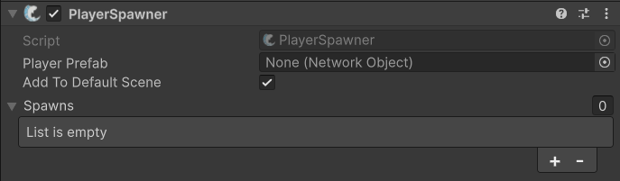

# PlayerSpawner

## Description 

The **PlayerSpawner** component in FishNet is responsible for spawning player objects for clients when they connect to the server. You set the player prefab using the inspector or via the `SetPlayerPrefab` method. You can also define an array of spawn points (Transforms) for players (the **Spawns** array). If no spawn points are set, the prefab’s own position and rotation are used. You also have access to the `OnSpawned` event that fires on the server when a player is spawned.


Check out the API page for specific fields and events [here](https://firstgeargames.com/FishNet/api/api/FishNet.Component.Spawning.PlayerSpawner.html).


## Settings 

<figure><figcaption>
Default Settings
</figcaption></figure>

### :gear:  **Player Prefab**

> This is used to select the prefab this component will instantiate for clients when they connect to the server.

### :gear:  **Add to Default Scene**

> This is used to add a client to the active scene when no global scenes are specified through the [FishNet SceneManager](../../guides/features/scene-management/). This is important because FishNet doesn't force a client to start in the same scene as the server, so FishNet needs to be told if a client should observe a specific scene and receive information about the Network Objects in that scene.

### :gear:  **Spawns**&#x20;

> This is a list of GameObject Transforms that the **PlayerSpawner** will use as locations to spawn the players at. It will use them in order, one after another, looping once it reaches the final one. If none are given, then it will use the prefab's base position.
