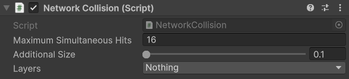

# NetworkCollision

## Description

This component is used for receiving collision events for prediction enabled objects. It is very much equivalent to a Collider's `OnCollisionEnter`, `OnCollisionExit`, and `OnCollisionStay` messages, except that to receive these you would add this component to your game object and subscribe to its public events.


Check out this API page [here](https://firstgeargames.com/FishNet/api/api/FishNet.Component.Prediction.NetworkCollider.html) for the specific details.


## Settings

<figure><figcaption>
Default Settings
</figcaption></figure>

### :gear:  **Maximum Simultaneous Hits**

> This is the maximum number of simultaneous hits that the component will check for. You can use this field to customize how many overlapping colliders the component should be able to detect. It should be noted that having too large of a value will decrease its performance. In most cases, the default value of 16 suffices.

### :gear:  **Additional Size**

> The **Additional Size** determines the distance in units by which collision traces are extended. This extension helps prevent missed overlaps when colliders do not intersect sufficiently. Depending on the scale used in your game you may want to raise or lower this value.

### :gear:  **Layers**

> These are the Layers to detect collisions on. This is used when value is not set as **Nothing**.
