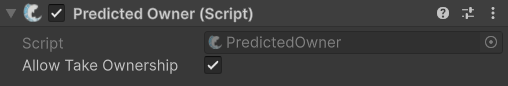

# PredictedOwner

## Description

The **PredictedOwner** allows clients to immediately simulate ownership on an object without waiting for the server's response. This overcomes delays from client latency, allowing for a seamless transition of ownership. Placing this component on an object enables this feature for that network object.

A client can use the [`TakeOwnership`](https://fish-networking.com/FishNet/api/api/FishNet.Component.Ownership.PredictedOwner.html#FishNet_Component_Ownership_PredictedOwner_TakeOwnership_System_Boolean_) method to anticipatorily claim ownership of an object. You can also access the [`PreviousOwner`](https://fish-networking.com/FishNet/api/api/FishNet.Component.Ownership.PredictedOwner.html#FishNet_Component_Ownership_PredictedOwner_PreviousOwner) of the object and by inheriting from this component you can add checks to the server to decide whether to accept the ownership change or reject it. This can be done by overriding the [`OnTakeOwnership`](https://fish-networking.com/FishNet/api/api/FishNet.Component.Ownership.PredictedOwner.html#FishNet_Component_Ownership_PredictedOwner_OnTakeOwnership_FishNet_Connection_NetworkConnection_System_Boolean_) method and not handing over the ownership for whatever reason you may have.


Check out its full API page for more specific methods and properties [here](https://fish-networking.com/FishNet/api/api/FishNet.Component.Ownership.PredictedOwner.html).


## Settings

<figure><figcaption>
Default settings
</figcaption></figure>

### :gear: **Allow Take Ownership**

> This enables or disables the functionality of this component, and can be set at run-time from the server with this method: [`SetAllowTakeOwnership`](https://fish-networking.com/FishNet/api/api/FishNet.Component.Ownership.PredictedOwner.html#FishNet_Component_Ownership_PredictedOwner_SetAllowTakeOwnership_System_Boolean_).
