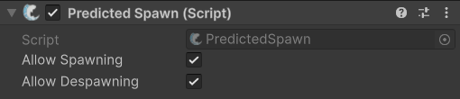

# PredictedSpawn

## Description

Adding this component to a [NetworkObject](../../../guides/features/networked-gameobjects-and-scripts/networkobjects/) will allow you to adjust [predicted spawning](../../../guides/features/networked-gameobjects-and-scripts/spawning/predicted-spawning.md) settings for the object. To enable this feature you must also enable predicted spawning within the [ServerManager](../managers/server-manager.md).

The **PredictedSpawn** component allows you to inherit from it and then override any of several available virtual methods to customize and validate predicted spawns.


Check out its full API page for the specific methods [here](https://firstgeargames.com/FishNet/api/api/FishNet.Component.Ownership.PredictedSpawn.html).


## Settings

<figure><figcaption>
Default Settings
</figcaption></figure>

### :gear:  **Allow Spawning**

> This allows clients to predicted spawn this object. You can change this at run-time with the [`SetAllowSpawning`](https://firstgeargames.com/FishNet/api/api/FishNet.Component.Ownership.PredictedSpawn.html#FishNet_Component_Ownership_PredictedSpawn_SetAllowDespawning_System_Boolean_) method. Just be sure to do so on the client and server side.

### :gear:  **Allow Despawning**

> This allows clients to predicted despawn this object. You can change this at run-time with the [`SetAllowDespawning`](https://firstgeargames.com/FishNet/api/api/FishNet.Component.Ownership.PredictedSpawn.html#FishNet_Component_Ownership_PredictedSpawn_SetAllowDespawning_System_Boolean_) method. Just be sure to do so on the client and server side.


You can implement WritePayload and ReadPayload in your classes which inherit NetworkBehaviour to send data with spawn messages. This can even be used for predicted spawns to the server, and clients!

Learn more about that here: [spawn-payloads.md](../../../guides/features/networked-gameobjects-and-scripts/spawning/spawn-payloads.md "mention")

