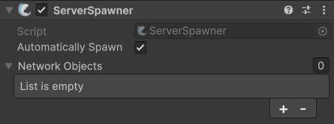

# ServerSpawner

## Description 

The **ServerSpawner** component is a helpful tool that you can use for optionally instantiating and spawning objects as soon as the FishNet server successfully starts running (or on your own command if preferred). This is very often used to instantiate [Global Network Objects](#user-content-fn-1)[^1], which need to be instantiated at run-time instead of existing inside a scene directly.

## Settings 

<figure><figcaption>
Default settings
</figcaption></figure>

### :gear:  **Automatically Spawn**

> This dictates whether the component will instantiate and spawn the objects as soon as the server starts, or only after you manually call `Spawn` on the **ServerSpawner** component.
>
> You can disable this if you want to manually control when these objects are spawned.

### :gear:  **Network Objects**

> This is a list of the Network Objects the component will instantiate once the server starts. The order of this list is respected when instantiating the objects, and the component will attempt to use [FishNet's object pooling](../../guides/features/networked-gameobjects-and-scripts/spawning/object-pooling.md) for the objects if they are added to the an object pool.

[^1]: These are NetworkObjects that are added to the DontDestroyOnLoad scene and visible to all clients.
