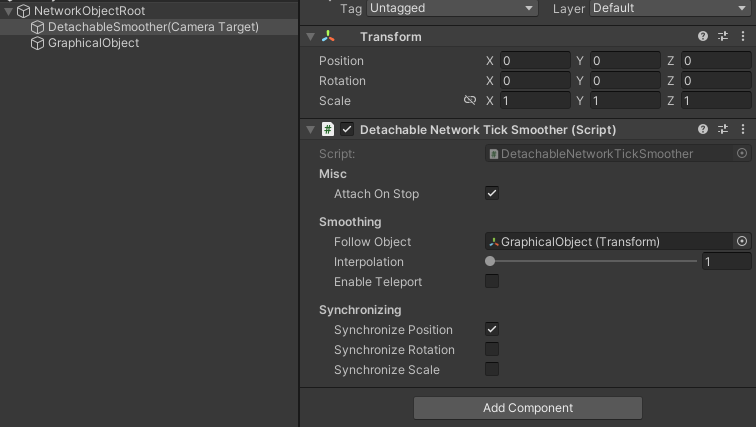
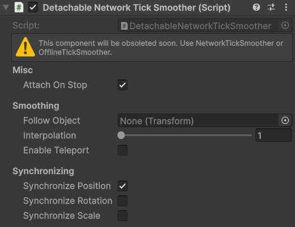

# DetachableNetworkTickSmoother \[Obsolete]


This component is obsolete, you can use the [networkticksmoother.md](networkticksmoother.md "mention") instead of this now.


## Description

The DetachableNetworkTickSmooth will detach from parents at runtime and follow the configured follow object. Generally this is placed on an empty object beneath the parent, and you will set your camera target to this.

<figure><figcaption>
For use with prediction. You may follow NetworkObjectRoot if not using prediction.
</figcaption></figure>

## Settings

<figure><figcaption>
Default settings
</figcaption></figure>

### :gear:  **Attach On Stop**

> This will re-attach this object to it's previous parent when the [NetworkObject](../network-object.md) for this component has completed network stop callbacks.

### :gear:  **Follow Object**

> This is the object to follow. This is typically the graphical object for the same NetworkObject.

### :gear:  **Interpolation**

> The **Interpolation** is how long in ticks to smooth over. Depending on your game type and camera settings, typically 1 or 2 works well.

### :gear:  **Enable Teleport**

> This will allow this object to teleport to Follow Object's position after a distance between tick has passed.
>
> * **Teleport Threshold** is shown while teleporting is enabled. If the graphical object's position is this many units away from the actual position, then the graphical object will teleport to the actual position.

### :gear:  **Teleport Threshold**

> This is shown while [Enable Teleport](detachablenetworkticksmoother-obsolete.md#enable-teleport) is enabled. If the graphical object's position is this many units away from the actual position, then the graphical object will teleport to the actual position.

### :gear:  **Synchronize Position**

> When enabled this will move this transforms position towards the follow object's.

### :gear:  **Synchronize Rotation**

> **Synchronize Rotation** will move this transforms rotation towards the follow object's if it is enabled.

### :gear:  **Synchronize Scale**

> When true, will move this transforms scale towards the follow object's.
