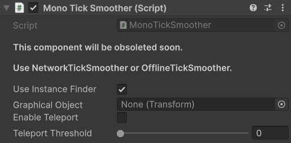

# MonoTickSmoother \[Obsolete]


This component is obsolete, you can use the [offlineticksmoother.md](offlineticksmoother.md "mention") instead of this now.


## Description

The main difference between NetworkTickSmoother and MonoTickSmoother is that MonoTickSmoother does not need to be placed on a networked object, and initializes by default using InstanceFinder; NetworkTickSmoother initializes using NetworkBehaviour callbacks.

## Settings

<figure><figcaption>
Default Settings
</figcaption></figure>

### :gear:  **Use Instance Finder**

> This option determines whether or not to use the [InstanceFinder](../../../guides/features/instancefinder-guides.md) to find the [TimeManager](../managers/time-manager.md). When this is false you will need to specify which TimeManager to use by calling `SetTimeManager`. This can be useful in cases where you have multiple [NetworkManagers](../managers/network-manager.md) and therefore multiple TimeManagers and you want to specify which one to use.

### :gear:  **Graphical Object**

> This is the object which holds the graphics you want to smooth. The graphics should be a child of the game object with this component.

### :gear:  **Enable Teleport**

> This will allow the graphical object to teleport to it's actual position – also known as the root position – if the position changes are drastic. Ideally you will not need this setting, but it's an available option should you desire to use it.

### :gear:  **Teleport Threshold**

> The **Teleport Threshold** is shown while teleporting is enabled. If the graphical object's position is this many units away from the actual position, then the graphical object will teleport to the actual position.
