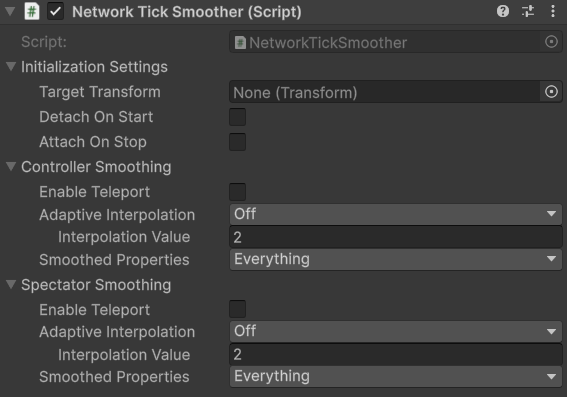

# NetworkTickSmoother

## Description

The **Network Tick Smoother** is responsible for smoothing an object's transformation properties between network ticks. Its main purpose is to make movement, rotation, and scale, transitions appear fluid, even though network updates may arrive in discrete steps. The **NetworkTickSmoother** initializes its settings using [NetworkBehaviour callbacks](../../../guides/features/networked-gameobjects-and-scripts/network-behaviour-guides.md#callbacks), and may only be placed below a [NetworkObject](../network-object.md); if you need this form of smoothing for objects that aren't NetworkObjects you can use the [offlineticksmoother.md](offlineticksmoother.md "mention") instead.

There are several public APIs available for changing the smoother settings at runtime. An example of some are changing adaptive interpolation type, interpolation value, teleporting the smoothed object, and more.


Please review our [API ](https://fish-networking.com/FishNet/api/api/FishNet.Component.Transforming.NetworkTickSmoother.html)for all runtime settings.


## Settings

<figure><figcaption>
Default settings
</figcaption></figure>

### :gear: Initialization Settings

> These are essential to the component working.
>
> * **Target Transform** is the transform you want to follow. This is commonly the root NetworkObject but may be other nested NetworkBehaviours when using multiple smoothers beneath a single NetworkObject.
> * **Detach On Start** when true will unparent the object which the smoother is attached, placing it as root in world space. Detach is commonly used when the smoothed object is a camera target, given cameras do not handle rollback or larger tick steps well.
> * **Attach On Stop** when true will reparent the graphical object when the network stop callbacks occur on the object, as detach will unparent on network start callbacks. Typically you want to reattach graphical objects. If the Target Transform is destroyed while detached the object the smoother is attached to will also destroy itself.

### :gear: **Controller Smoothing**

> The **Controller Smoothing** settings determine how the object is smoothed for the controller of the object, which is either the owner or if the object has no owner then it is the server.
>
> * **Enable Teleport** will allow the graphical object to teleport to it's actual position – also known as the root position – if the position changes are drastic. Ideally you will not need this setting, but it's an available option should you desire to use it.
>   * **Teleport Threshold** is shown while teleporting is enabled. If the graphical object's position is this many units away from the actual position, then the graphical object will teleport to the actual position.
> * **Adaptive Interpolation,** when not disabled, will increase the interpolation amount as the local client's latency becomes higher. Low settings of adaptive interpolation will increase the interpolation at lower amounts, while high will increases the interpolation more. When Adaptive Interpolation is disabled, a flat amount of interpolation will used at all times.\
>   \
>   Flat interpolation is often used in competitive or reaction based games to keep the interpolation consistent for all players. Flat interpolation is also necessary for accurate collider rollback, given our [collider rollback system](../../../guides/features/lag-compensation/) needs to know the amount of interpolation a client sees to provide accurate raycast hit results.\
>   \
>   Adaptive interpolation is best used with casual games where you want the absolute smoothed experiences regardless of local client latency.
>   * **Interpolation Value** is displayed when Adaptive Interpolation is off. This is a flat amount of interpolation that does not increase when the local client's latency does.
> * **Smoothed Properties** determines which properties of the transform will be smoothed. If smoothing is not set for a specific property then that particular value will persist in the same world space at all times. For example, if you uncheck Position from Smoothed Properties and move the root, the object which this component sits will never move in space, unless you of course move it manually.

### :gear: Spectator Smoothing

> The **Spectator Smoothing** settings determine how the object is smoothed for client's that are **not** the owner.
>
> * **Enable Teleport** will allow the graphical object to teleport to it's actual position – also known as the root position – if the position changes are drastic. Ideally you will not need this setting, but it's an available option should you desire to use it.
>   * **Teleport Threshold** is shown while teleporting is enabled. If the graphical object's position is this many units away from the actual position, then the graphical object will teleport to the actual position.
> * **Adaptive Interpolation,** when not disabled, will increase the interpolation amount as the local client's latency becomes higher. Low settings of adaptive interpolation will increase the interpolation at lower amounts, while high will increases the interpolation more. When Adaptive Interpolation is disabled, a flat amount of interpolation will used at all times.\
>   \
>   Flat interpolation is often used in competitive or reaction based games to keep the interpolation consistent for all players. Flat interpolation is also necessary for accurate collider rollback, given our [collider rollback system](../../../guides/features/lag-compensation/) needs to know the amount of interpolation a client sees to provide accurate raycast hit results.\
>   \
>   Adaptive interpolation is best used with casual games where you want the absolute smoothed experiences regardless of local client latency.
>   * **Interpolation Value** is displayed when Adaptive Interpolation is off. This is a flat amount of interpolation that does not increase when the local client's latency does.
> * **Smoothed Properties** determines which properties of the transform will be smoothed. If smoothing is not set for a specific property then that particular value will persist in the same world space at all times. For example, if you uncheck Position from Smoothed Properties and move the root, the object which this component sits will never move in space, unless you of course move it manually.

## Scale Smoothing

Scale behaves a little differently when smoothed. Since nested objects use a localScale they will not change with the parent scale, and thus cannot be easily interpolated.

If you wish to smooth scale transitions then **Detach** (and optionally **Reattach**) must be enabled in the initialization settings so that the smoothed object does not have it's global (lossy) scale modified by Unity when the target transform or any higher transform has it's scale changed.
