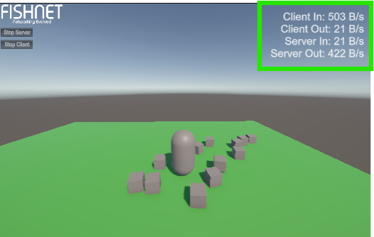
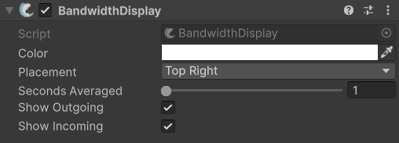

# BandwidthDisplay

## Description

Using this component in combination with the [Statistics Manager](../managers/statisticsmanager.md) will show bandwidth being used by Fish-Networking.

<figure><figcaption>
Example of the BandwidthDisplay being used.
</figcaption></figure>

## Settings

<figure><figcaption>
Default Settings
</figcaption></figure>

### :gear:  **Color**

> This is which color to display results as.

### :gear:  **Placement**

> The **Placement** is in what part of the screen to display results.

### :gear:  **Seconds Averaged**

> This is for the number of seconds used to gather data. Lower values will show more up to date usage per second while higher values provide a better over-all estimate.

### :gear:  **Show Outgoing**

> When enabled, this will display the bandwidth used from data being sent. This can be changed at runtime with the [`SetShowOutgoing`](https://firstgeargames.com/FishNet/api/api/FishNet.Component.Utility.BandwidthDisplay.html#FishNet_Component_Utility_BandwidthDisplay_SetShowOutgoing_System_Boolean_) method.

### :gear:  **Show Incoming**

> When enabled, this will display the bandwidth used from data being received. This can be changed at runtime with the [`SetShowIncoming`](https://firstgeargames.com/FishNet/api/api/FishNet.Component.Utility.BandwidthDisplay.html#FishNet_Component_Utility_BandwidthDisplay_SetShowIncoming_System_Boolean_) method.
