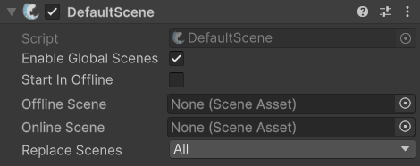

# DefaultScene

## Description

This component will automatically change between online and offline scenes depending on server and client connective state. When a connection is started the online scene is loaded, and when disconnected the offline scene is loaded. This component must be placed on or beneath your [NetworkManager](../managers/network-manager.md).


Check out the API page for specific methods [here](https://fish-networking.com/FishNet/api/api/FishNet.Component.Scenes.DefaultScene.html).



For this component to work, both the online scene and the offline scene must be selected in the inspector, and they must not be the same scene.


## Settings

<figure><figcaption>
Default Settings
</figcaption></figure>

### :gear: **Enable Global Scenes**

> This will load the scenes as global when enabled, or as connection when not. For more information on the differences see [Scene Loading](../../../guides/features/scene-management/loading-scenes/).

### :gear: **Start In Offline**

> This will load the server and clients into the offline scene when the game starts.

### :gear: **Offline Scene**

> This is the scene to load when offline.

### :gear: **Online Scene**

> This is the scene to load when online.

### :gear: **Replace Scenes**

> This can be set to replace all loaded scenes, or just online scenes with the Online or Offline scene. For more information see loading [Scene Loading - replacing scenes](../../../guides/features/scene-management/loading-scenes/).
