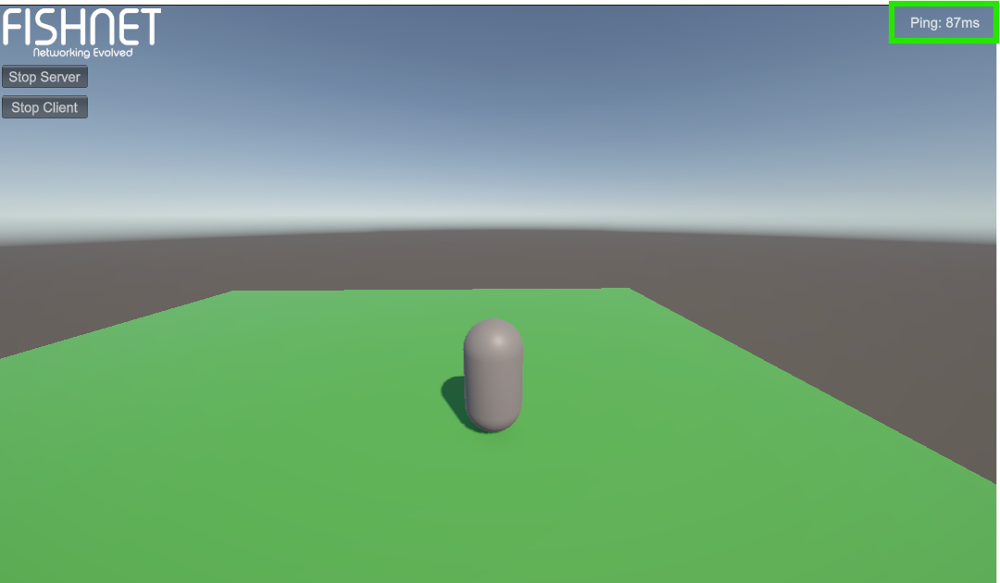
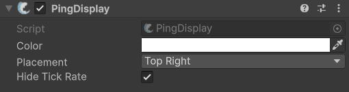

# PingDisplay

## Description

Often times you may want to display the local client's ping while developing your game, this can easily be done with the **PingDisplay** component. This component is commonly added to the [NetworkManager](../managers/network-manager.md) object, but that is not a requirement.

<figure><figcaption>
Example of the PingDisplay component in-use
</figcaption></figure>

## Settings

<figure><figcaption>
Default settings
</figcaption></figure>

### :gear:  **Color**

> This is which color to use for the displayed text.

### :gear:  **Placement**

> The P**lacement** indicates in which part of the screen to display the client's ping.

### :gear:  **Hide Tick Rate**

> This option will remove tick rate latency from the ping results otherwise the displayed ping will include the delay caused by the server's tick rate.
