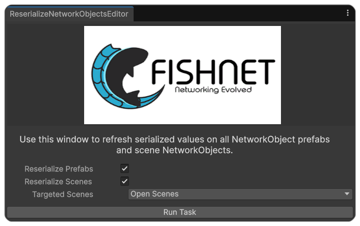
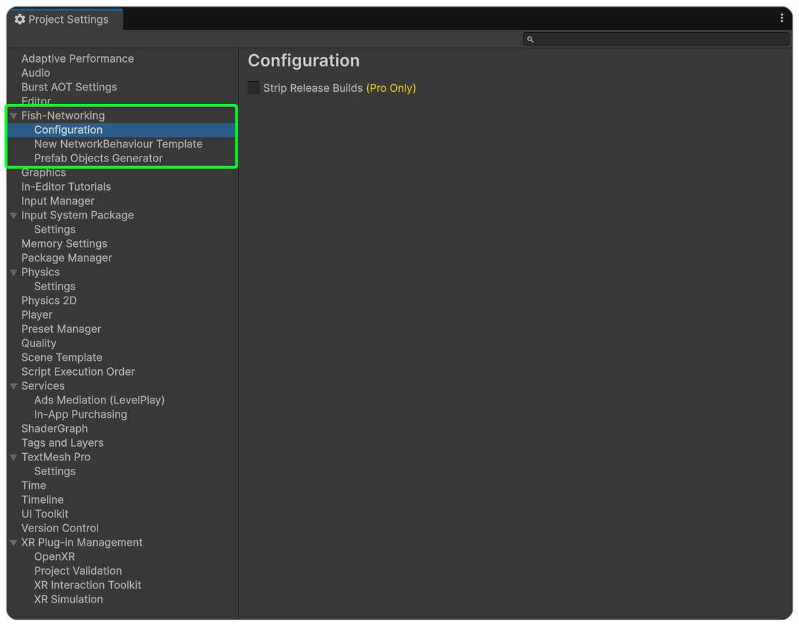
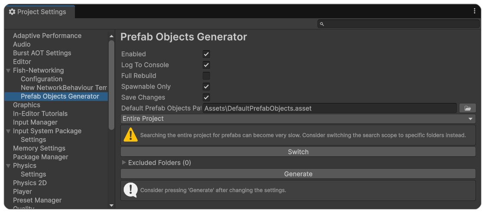
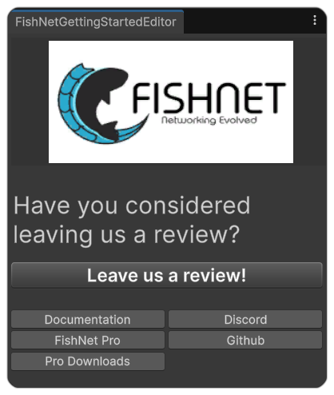

# Configuration and Tools

FishNet comes with some useful settings and editor tools to be used with it; these can be accessed through the (**Tools → Fish-Networking**) toolbar menu.

<figure><figcaption></figcaption></figure>

***

## Beta

The settings here will vary depending on your FishNet version and will enable you to activate and deactivate the latest beta features. This can be helpful if you want to stay with the most tested code for you project or if alternatively if you want to try out features that are coming out soon.

***

## Utility

### Quality of Life Attributes

With this option you will be able to disable and enable certain attributes FishNet uses. It's not recommended to use this unless a developer or community helper advises you do so for debugging purposes.

### Upgrading From Mirror

When converting a project from Mirror Networking, it can be helpful to use these tools.

#### Replace Components

This tool helps you replace common Mirror components with what FishNet may use instead.&#x20;

#### Remove Defines

This tool removes the many scripting defines that Mirror includes in your Unity project.

### Refresh Default Prefabs

This option will cause FishNet's [Default Prefab Objects](scriptableobjects/spawnableprefabs/defaultprefabobjects.md) tool to be refreshed by searching your project and keeping track of the Network Object Prefabs within it. This is done automatically for you, but you may want to trigger it if you start seeing the wrong prefabs being spawned in a client build or editor.

### Reserialize NetworkObjects

This tool allows you to reserialize prefabs and scenes. Most often you will use this if you get an error message by FishNet telling you to do so. It can also help you if you are running into errors reporting missing sceneids.&#x20;


If you run it on the open scenes, be sure to save them after it runs.


<figure><figcaption></figcaption></figure>

***

## Configuration

The FishNet configuration (available in the Project Settings) has options for FishNet Pro's **Code Stripping** feature as well as the Prefab Objects Generator and NetworkBehaviour Template.

<figure><figcaption></figcaption></figure>

#### Code Stripping

FishNet Pro allows you to strip server-only code from [non-server builds](#user-content-fn-1)[^1], this includes the code inside [ServerRpcs](../guides/features/network-communication/remote-procedure-calls.md#serverrpc), [Server](../guides/features/server-and-client-identification/executing-on-server-or-client.md#server-attribute) marked methods, and server specific callbacks such as [OnStartServer](../guides/features/networked-gameobjects-and-scripts/network-behaviour-guides.md#onstartserver) and [OnSpawnServer](../guides/features/networked-gameobjects-and-scripts/network-behaviour-guides.md#onspawnserver). You can use one of the two available methods for this, either **redirection** or **emptying.**

#### New NetworkBehaviour Template

This allows you to customize the NetworkBehaviour asset template as well as choose a new location for it. If you want to create a NetworkBehaviour using this template, simply go to **Assets → FishNet → NetworkBehaviour Script.**

#### Prefab Objects Generator

The Prefab Objects Generator is used by the [Default Prefab Objects](scriptableobjects/spawnableprefabs/defaultprefabobjects.md) search your project and keep track of the Network Object Prefabs within it. You can enable and disable it as well as enable and disable its logging.

The **Full Rebuild** option will tell FishNet to search all prefabs instead of just ones that were recently modified.

**Spawnable Only** instructs the generator to only find NetworkObject prefabs that have [IsSpawnable](https://fish-networking.com/FishNet/api/api/FishNet.Object.NetworkObject.html#FishNet_Object_NetworkObject_IsSpawnable) enabled.

The **Default Prefab Objects Path** option allows you to change the default path of the asset in your Unity project.

And finally you can choose which folders to exclude or include when it searches for network prefabs.

<figure><figcaption></figcaption></figure>

***

## Getting Started

The getting started option will show FishNet's **Getting Started** menu, giving you quick access to relevant FishNet links, including the Documentation, Discord, GitHub, and more.

<figure><figcaption></figcaption></figure>

[^1]: Regular build profiles that aren't headless/dedicated server
