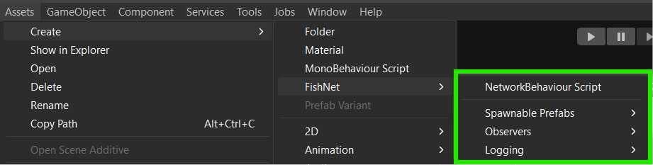

# ScriptableObjects

Fish-Networking includes quite a few [ScriptableObjects ](https://docs.unity3d.com/Manual/class-ScriptableObject.html)that you can use to customize the behavior of specific features. There are default ones included with FishNet, but you can also create your own from the _**Assets → Create → FishNet**_ toolbar menu.

<figure><figcaption>
Create FishNet asset menu
</figcaption></figure>
