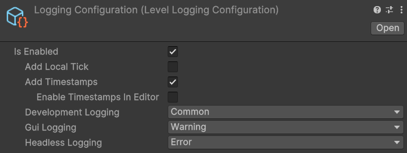

# LevelLoggingConfiguration

## Description 

The **Level Logging Configuration** scriptable object simply allows you to customize Fish-Networking's logging. Once created, it can be selected on the [NetworkManager](../components/managers/network-manager.md) component. There are four logging levels available for the various build and editor types. **Off** will permit no logs, **Error** will only permit direct error logs, **Warning** will allow error and warning logs, and **Common** will allow all logging, including errors, warnings, and informational logs.

## Settings 

<figure><figcaption>
Default Settings
</figcaption></figure>

### :gear: **Logging Enabled**

> This is simply a toggle to enable and disable all of Fish-Networking's logs.

### :gear: **Development Logging**

> This controls the level of logs sent while the game is a development build or editor.

### :gear: **GUI Logging**

> This controls the level of logging to use when the game is built regularly, as opposed to a headless (non GUI) build.

### :gear: **Headless Logging**

> This controls the logging level for headless game builds.
