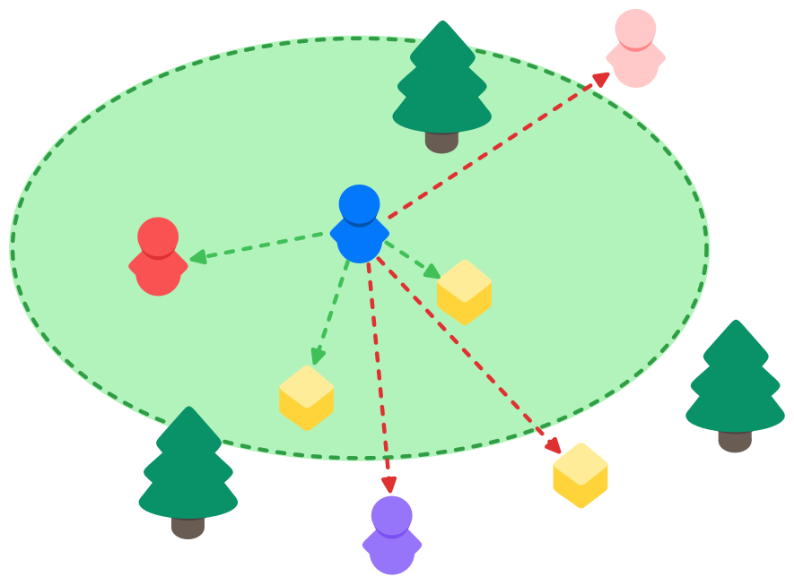
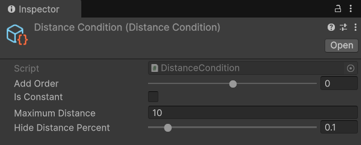

# DistanceCondition

## Description 

The **Distance Condition** ensures that an object is only observed if it is at least a specified minimum distance away from all objects owned by a client. The Distance Condition is a [Timed Condition](#user-content-fn-1)[^1].

<figure><figcaption></figcaption></figure>

## Settings 

<figure><figcaption>
Default settings
</figcaption></figure>

### :gear: **Add Order**

> This controls the order in which this observer condition will be evaluated on an object.
>
> This can be very useful when having observer conditions that are more computationally complex than others, as it allows you to choose the order in which they will be evaluated. Timed conditions are always evaluated after non-timed conditions.

### :gear: **Is Constant**

> Is used to declare whether the condition's settings or data will remain unchanged at runtime. Its purpose is to optimize performance by avoiding unnecessary updates or recalculations for conditions that do not change during execution. It is currently not implemented, but is available for future use and can already be set.

### :gear: **Maximum Distance**

> The maximum distance that any object owned by a client must be within an object to observe it. If all of the client's owned [NetworkObjects](../../../guides/features/networked-gameobjects-and-scripts/networkobjects/) are farther than this distance, the object will not be visible to them.

### :gear: **Hide Distance Percent**

> **This** determines an additional buffer zone beyond the maximum distance before an object is hidden. The purpose of the "Hide Distance Percent" is to prevent objects from flickering in and out of visibility when a client is near the maximum distance threshold. It creates a smoother transition for hiding objects by adding a percentage-based distance buffer. As an example, if the **Maximum Distance** is set to `100f` and the **Hide Distance Percent** is `0.5` (50%), the object will remain visible until the client is `150f` units away. This ensures objects do not disappear immediately as they cross the initial visibility boundary.

[^1]: A Timed Condition is evaluated periodically rather than only when certain conditions change.
