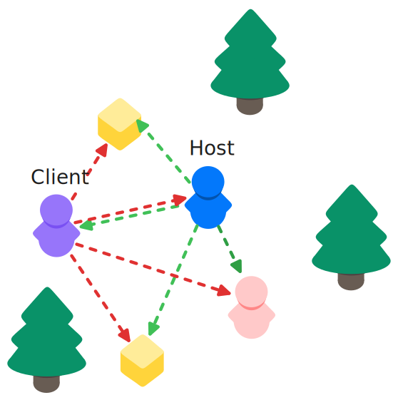

---
layout:
  title:
    visible: true
  description:
    visible: false
  tableOfContents:
    visible: true
  outline:
    visible: true
  pagination:
    visible: true
---

# HostOnlyCondition

## Description 

The **Host Only Condition** evaluates to true when the player is a client host. Any connection which is not client host will fail this evaluation. You can use this observer condition to only show objects to the host player, either permanently or temporarily. This condition is not a timed condition.

<figure><figcaption></figcaption></figure>

## Settings 

<figure><figcaption>
Default Settings
</figcaption></figure>

### :gear:  **Add Order**

> This controls the order in which this observer condition will be evaluated on an object.
>
> This can be very useful when having observer conditions that are more computationally complex than others, as it allows you to choose the order in which they will be evaluated. Timed conditions are always evaluated after non-timed conditions.

### :gear:  **Is Constant**

> Is used to declare whether the condition's settings or data  will remain unchanged at runtime. Its purpose is to optimize performance by avoiding unnecessary updates or recalculations for conditions that do not change during execution. It is currently not implemented, but is available for future use and can already be set.
