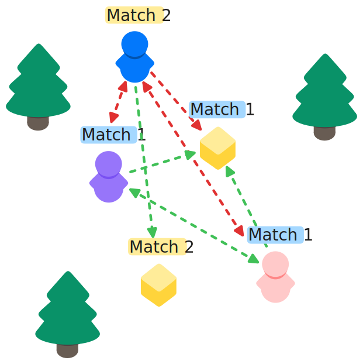
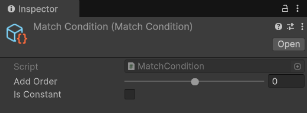

# MatchCondition

## Description 

The **Match Condition** evaluates to true when players or objects share the same match[^1]. Both owned and non-owned objects can be added to matches. Objects or players not added to matches will have their data synchronized with everyone, unless prevented by another condition. See the [MatchCondition api](https://fish-networking.com/FishNet/api/api/FishNet.Component.Observing.MatchCondition.html) for more information on usage. This condition is not a timed condition.

<figure><figcaption></figcaption></figure>

## Settings 

<figure><figcaption>
Default Settings
</figcaption></figure>

### :gear: **Add Order**

> This controls the order in which this observer condition will be evaluated on an object.
>
> This can be very useful when having observer conditions that are more computationally complex than others, as it allows you to choose the order in which they will be evaluated. Timed conditions are always evaluated after non-timed conditions.

### :gear: **Is Constant**

> Is used to declare whether the condition's settings or data will remain unchanged at runtime. Its purpose is to optimize performance by avoiding unnecessary updates or recalculations for conditions that do not change during execution. It is currently not implemented, but is available for future use and can already be set.

[^1]: A _match_ can mean a lot of different things, but in this case it is basically a custom tag you can give objects and players to separate them from observing one another.
