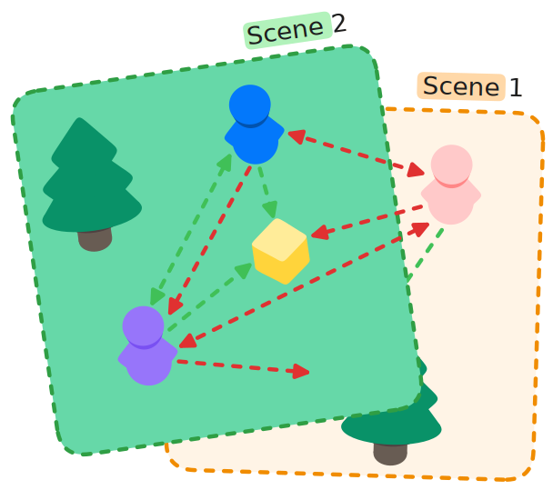
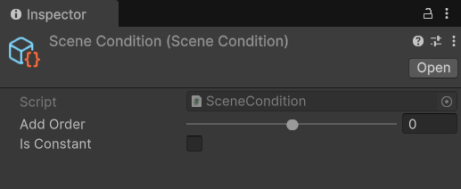

# SceneCondition

## Description 

The **Scene Condition** evaluates to true if the client shares any scenes with the object. This is arguably the most important observer condition, and it is the only one that is added by default to the [example NetworkManager prefab](../../prefabs/networkmanager.md). This condition is important because it helps avoid serious de-syncs that would happen if the server tried to tell clients about objects from a scene they haven't yet loaded.

<figure><figcaption></figcaption></figure>

## Settings 

<figure><figcaption>
Default Settings
</figcaption></figure>

### :gear: **Add Order**

> This controls the order in which this observer condition will be evaluated on an object.
>
> This can be very useful when having observer conditions that are more computationally complex than others, as it allows you to choose the order in which they will be evaluated. Timed conditions are always evaluated after non-timed conditions.

### :gear: **Is Constant**

> Is used to declare whether the condition's settings or data will remain unchanged at runtime. Its purpose is to optimize performance by avoiding unnecessary updates or recalculations for conditions that do not change during execution. It is currently not implemented, but is available for future use and can already be set.
