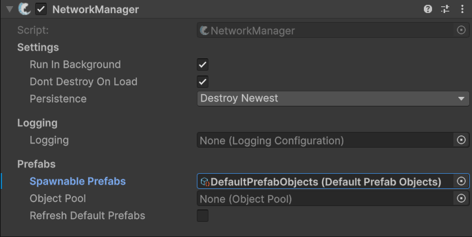

---
layout:
  title:
    visible: true
  description:
    visible: false
  tableOfContents:
    visible: true
  outline:
    visible: true
  pagination:
    visible: true
---

# SpawnablePrefabs

Fish-Networking uses a collection of prefabs to manage spawning of network objects across the network. Whenever you instantiate and [spawn](../../../guides/features/networked-gameobjects-and-scripts/spawning/) an object on the server, FishNet will use the selected **Spawnable Prefabs** collection to find which object it is and to automatically instantiate and link the objects on all clients.

The **Spawnable Prefabs** collection can be set on your [NetworkManager](../../components/managers/network-manager.md) component.&#x20;


The NetworkManager will automatically set the **Spawnable Prefabs** to an automatically managed [DefaultPrefabObjects ](defaultprefabobjects.md)asset if a custom one is not selected.&#x20;


<figure><figcaption>
The <strong>Spawnable Prefabs</strong> field on the NetworkManager
</figcaption></figure>

