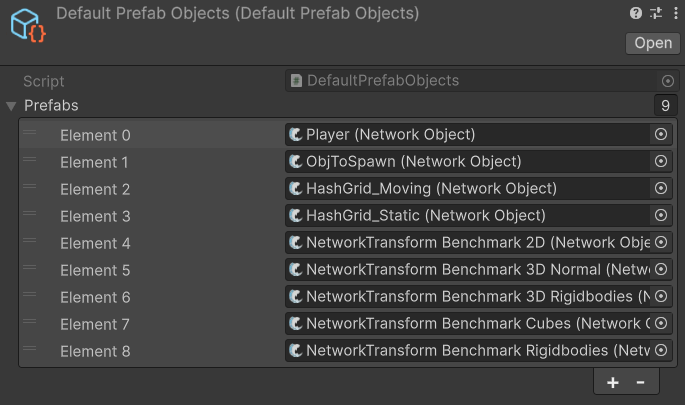

---
layout:
  title:
    visible: true
  description:
    visible: false
  tableOfContents:
    visible: true
  outline:
    visible: true
  pagination:
    visible: true
---

# DefaultPrefabObjects

The **Default Prefab Objects** asset is a dynamically populated collection of spawnable network objects. FishNet automatically generates it in the designated directory specified in your Fish-Networking configuration, filling it with networked prefabs from the configured locations.


You do not need to manually populate or update this collection, FishNet will take care of it automatically.


<figure><figcaption></figcaption></figure>
