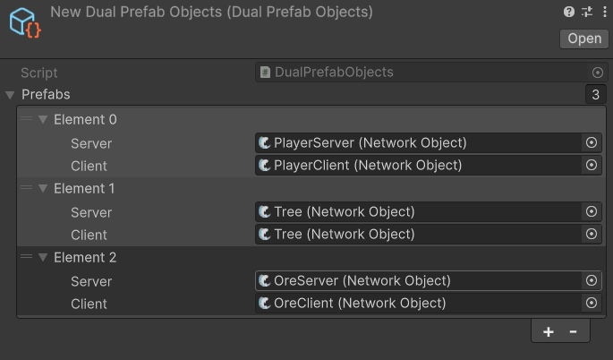

# DualPrefabObjects

The Dual Prefab Objects asset can be used to have Fish-Networking spawn a different prefab on the clients as it uses on the server. Whenever you spawn the server selected version, FishNet will spawn the client version on all clients.


You can select the same prefab in both the Server and Client fields to have the same one spawned on all clients as the server.


<figure><figcaption>
Example of a <strong>Dual Prefab Objects</strong> asset being populated
</figcaption></figure>
