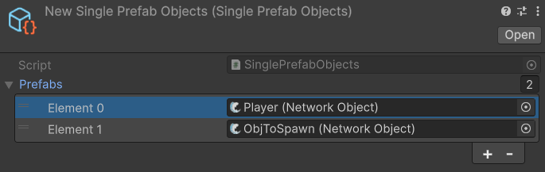

---
layout:
  title:
    visible: true
  description:
    visible: false
  tableOfContents:
    visible: true
  outline:
    visible: true
  pagination:
    visible: true
---

# SinglePrefabObjects

The **Single Prefab Objects** is a scriptable object which you can inherit from for custom functionality. It is used by the DefaultPrefabObjects collection and can also be directly used for your own collections. If using it directly, remember to manually add all your spawnable network object prefabs into its collection.

<figure><figcaption>
A single prefab objects asset being manually populated
</figcaption></figure>
