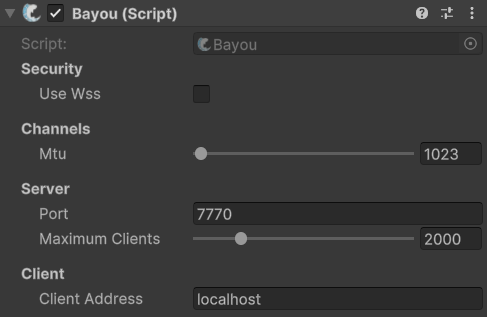

---
layout:
  width: default
  title:
    visible: true
  description:
    visible: false
  tableOfContents:
    visible: true
  outline:
    visible: true
  pagination:
    visible: true
  metadata:
    visible: true
---

# Bayou

## Description

Bayou is the transport you are looking for when you want communication on WebGL!\
\
It is an updated and repurposed version of the "SimpleWebTransport" That was originally designed for Mirror Networking.

***

## Compatibility

<table data-full-width="false"><thead><tr><th width="149">System</th><th width="198">Supported?</th></tr></thead><tbody><tr><td>Windows</td><td><mark style="color:green;">Fully Supported</mark></td></tr><tr><td>MacOS</td><td><mark style="color:green;">Fully Supported</mark></td></tr><tr><td>Linux</td><td><mark style="color:green;">Fully Supported</mark></td></tr><tr><td>Web</td><td><mark style="color:green;">Fully Supported</mark></td></tr><tr><td>IOS</td><td><mark style="color:green;">Fully Supported</mark></td></tr><tr><td>Android</td><td><mark style="color:green;">Fully Supported</mark></td></tr><tr><td>Xbox</td><td><mark style="color:green;">Fully Supported</mark></td></tr><tr><td>PlayStation</td><td><mark style="color:red;">Not Supported</mark></td></tr><tr><td>Nintendo</td><td><mark style="color:red;">Not Supported</mark></td></tr></tbody></table>

***

## How to Install

Bayou does not come with FishNet by default, you must download it from GitHub.\
You can find the latest version at the link below!

[https://github.com/FirstGearGames/Bayou/](https://github.com/FirstGearGames/Bayou/)\
\
Once Downloaded and Imported into Unity with FishNet. You should add the component to your Network manager, and Assign the "Transport" variable on the Transport Manager to Tugboat.

***

## Settings

<figure><figcaption>
Default settings
</figcaption></figure>

### :gear: **Use WSS**

> When enabled, Bayou will use Secure WebSockets instead of normal WebSockets.
>
> When this is enabled the following options will be available:
>
> * **Enabled**: Turns on/off Requiring SSL Certificate.
> * **Certificate Path**: File Path for the certificate
> * **Certificate Password**: Password for certificate
> * **SSL Protocol**: The protocol you would like to use for encryption.

### :gear: **MTU**

> Maximum Transmission Unity for the unreliable channel (in bytes)

### :gear: **Port**

> The port you want to bind the server to. Default port is 7770.

### :gear: **Maximum Clients**

> The maximum amount of clients allowed to connect to the server. Default is 2000 clients.

### :gear: **Client Address**

> The Address the client should use to connect to the server.
