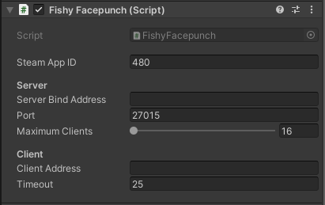

# FishyFacepunch (Steam)

## General

FishyFacepunch is a transport to interface with Steam using Facepunch.Steamworks API.\
\
You will need FishyFacepunch to be the transport layer, and you will need FacePunch.Steamworks, which is a subjectively simpler wrapper for the Steamworks.Net API.\
\
See the How to Install section to setup the Transport and FacePunch.Steamworks.

***

## Compatibility

<table data-full-width="false"><thead><tr><th width="149">System</th><th width="198">Supported?</th></tr></thead><tbody><tr><td>Windows</td><td><mark style="color:green;">Fully Supported</mark></td></tr><tr><td>MacOS</td><td><mark style="color:green;">Fully Supported</mark></td></tr><tr><td>Linux</td><td><mark style="color:green;">Fully Supported</mark></td></tr><tr><td>Web</td><td><mark style="color:red;">Not Supported</mark></td></tr><tr><td>IOS</td><td><mark style="color:red;">Not Supported</mark></td></tr><tr><td>Android</td><td><mark style="color:red;">Not Supported</mark></td></tr><tr><td>Xbox</td><td><mark style="color:red;">Not Supported</mark></td></tr><tr><td>PlayStation</td><td><mark style="color:red;">Not Supported</mark></td></tr><tr><td>Nintendo</td><td><mark style="color:red;">Not Supported</mark></td></tr></tbody></table>

***

## How to install

To install visit [https://github.com/FirstGearGames/FishyFacepunch](https://github.com/FirstGearGames/FishyFacepunch) and follow the Setup instructions.


Note that this transport requires Facepunch.Steamworks to be installed separately, as well as .Net 4x or greater. Links to install these should be on the GitHub as well.


***

## Component settings

<figure><figcaption>
Default settings
</figcaption></figure>

* **Steam App ID:** The App ID assigned to your game when registered with Steam. The default is 480 which is Steam's testing game (SpaceWar).

#### Server

* **Server Bind Address:** Used if you want to manually Bind a Steam ID to the server.
* **Port:** The port you want the server to be binded to. Default is 27015
* **Maximum Clients:** The maximum amount of clients you would like to connect to the server. Default is 16.

#### Client

* **ClientAddress:** The Steam ID of the server you are connecting to. The Servers Steam ID if its standalone, or the Hosts Client Steam ID if the server is a host.
* **Timeout (Seconds):** The amount of time allowed to establish a connection, in seconds.
