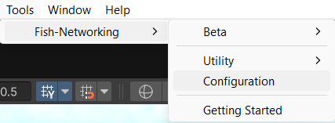
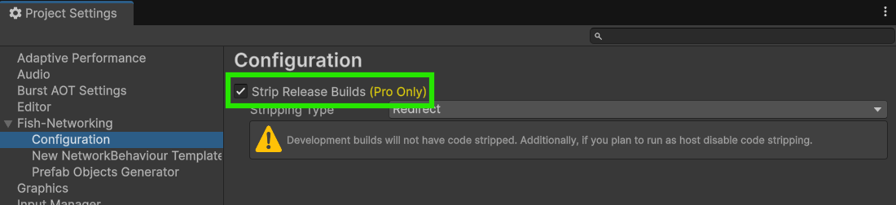
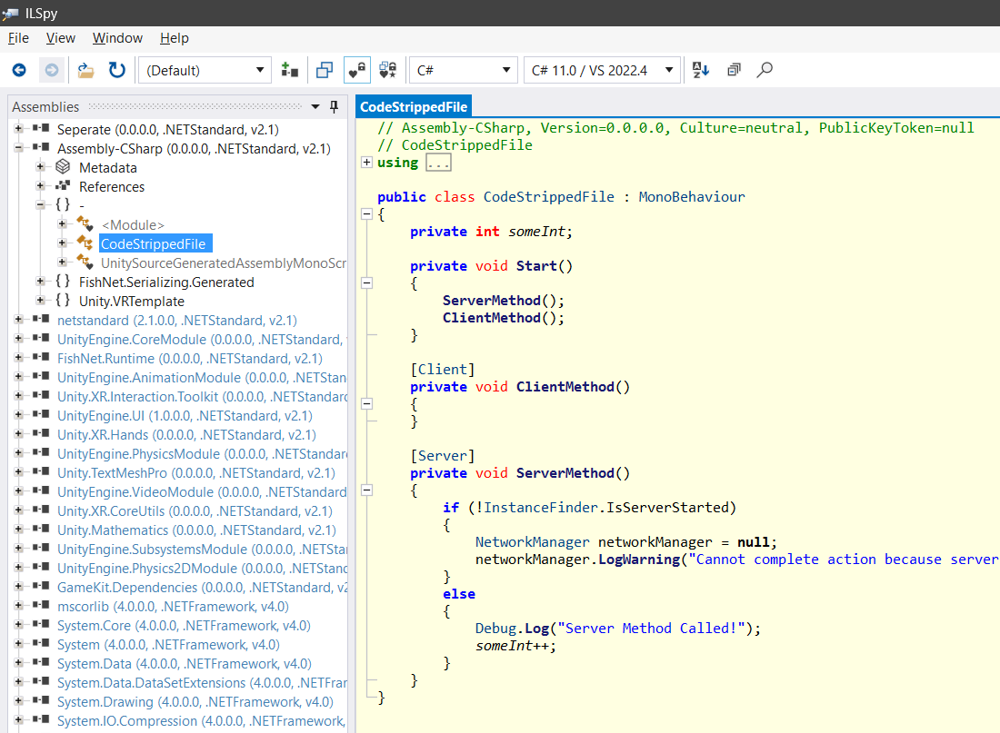

# Code Stripping (Pro Feature)

## Why use code stripping?

It helps secure your game server by removing sensitive logic that players shouldn’t see. This makes it harder for cheaters to figure out how the server works and keeps sensitive server data hidden.

## What gets stripped

FishNet Pro can remove server code from [non-server builds](#user-content-fn-1)[^1] and client code from [server builds](#user-content-fn-2)[^2]. The code it strips is code within [RPCs](network-communication/remote-procedure-calls.md), code marked with the [Server or Client attributes](server-and-client-identification/executing-on-server-or-client.md#method-attributes), as well as server and client only callbacks such as [OnStartServer/OnStartClient](networked-gameobjects-and-scripts/network-behaviour-guides.md#callbacks).

## How to use it

1. To use FishNet's code stripping you will firstly need to have **FishNet Pro** installed, you can find details for how to install it here: [upgrading-to-fishnet-pro.md](../updating-fishnet/upgrading-to-fishnet-pro.md "mention")
2.  Next, you can navigate to the **FishNet Configuration menu** through the Unity toolbar:&#x20;

    
<figure><figcaption>
<strong>(Tools → Fish-Networking → Configuration)</strong>
</figcaption></figure>

3.  On the Configuration page you will see the option to **"Strip Release Builds"**, enable it.&#x20;

    
<figure><figcaption></figcaption></figure>

4. There is now the **"Stripping Type"** option that you can switch between **Redirect** and **Empty\_Experimental**. **Redirect** will replace the methods and calls with a dummy method that doesn't contain any of the logic, while **Empty\_Experimental** will keep the same method, but will strip its method body, leaving it empty. You can use either option you want to.
5. Now you will need your game to recompile its scripts, you can trigger this by changing something in your code. If your code is in a separate assembly, be sure to trigger that assembly to recompile as well. This is only needed after you change the FishNet stripping settings.
6. That's all you need to do, you can now build your game, and FishNet will automatically strip the code for you.

## Confirming it worked

It's always a good idea to check if the sensitive code was indeed stripped from the builds. For Unity Mono builds you can easily do so using a tool such as [ILSpy](https://github.com/icsharpcode/ILSpy).

You can download the above-mentioned tool or another of your choosing. Then you'll want to run it and load the chosen assembly in your built game's files. If you find your script, you should see how FishNet stripped its code according to the build.

In the picture below you can see how the `ClientMethod` has had its method body emptied in this server build.

<figure><figcaption></figcaption></figure>

[^1]: Server builds are considered builds made using Unity's "Dedicated server build profile" or its "headless mode" option in older Unity versions.\
    Any other builds are considered non-server builds.

[^2]: Server builds are considered builds made using Unity's "Dedicated server build profile" or its "headless mode" option in older Unity versions.
    \
    Any other builds are considered non-server builds.
