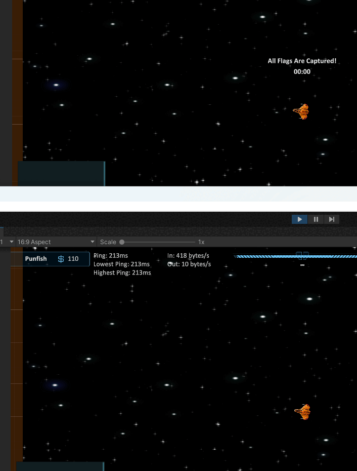

# Projectiles

Projectiles which move over time can have lag hidden by accelerating the projectiles for the server and spectators, while allowing the firing client to show the projectile immediately.&#x20;

Another bonus to this approach is you are not networking the projectile movement each tick, which saves tremendously on bandwidth and performance.

Here is an example of what this guide will cover. Notice how even though the client has a 220ms ping the projectile is still aligned on the server. Other clients would align the projectile as well with the same guide code.

<figure><figcaption></figcaption></figure>

First the local client, or owning client, fires the projectile. The projectile is spawned locally, then the client tells the server to also fire the projectile. The MAX\_PASSED\_TIME constant is covered in the next code snippet.

```csharp
/// <summary>
/// Projectile to spawn.
/// </summary>
[Tooltip("Projectile to spawn.")]
[SerializeField]
private PredictedProjectile _projectile;
/// <summary>
/// Maximum amount of passed time a projectile may have.
/// This ensures really laggy players won't be able to disrupt
/// other players by having the projectile speed up beyond
/// reason on their screens.
/// </summary>
private const float MAX_PASSED_TIME = 0.3f;

/// <summary>
/// Local client fires weapon.
/// </summary>
private void ClientFire()
{
    Vector3 position = transform.position;
    Vector3 direction = transform.forward;

    /* Spawn locally with 0f passed time.
     * Since this is the firing client
     * they do not need to accelerate/catch up
     * the projectile. */
    SpawnProjectile(position, direction, 0f);
    //Ask server to also fire passing in current Tick.
    ServerFire(position, direction, base.TimeManager.Tick);
}

/// <summary>
/// Spawns a projectile locally.
/// </summary>
private void SpawnProjectile(Vector3 position, Vector3 direction, float passedTime)
{
    PredictedProjectile pp = Instantiate(_projectile, position, Quaternion.identity);
    pp.Initialize(direction, passedTime);
}#
```

When the server receives the fire request it will calculate how long it took the client to send the fire message using the provided tick. Later on the projectile will be accelerated based on this time passed.

After the _passedTime_ is calculated, spawn the projectile on the server, then tell spectators to also spawn the projectile; spectators being other clients.

```csharp
/// <summary>
/// Fires on the server.
/// </summary>
/// <param name="position">Position to spawn projectile.</param>
/// <param name="direction">Direction to move projectile.</param>
/// <param name="tick">Tick when projectile was spawned on client.</param>
[ServerRpc]
private void ServerFire(Vector3 position, Vector3 direction, uint tick)
{
    /* You may want to validate position and direction here.
     * How this is done depends largely upon your game so it
     * won't be covered in this guide. */

    //Get passed time. Note the false for allow negative values.
    float passedTime = (float)base.TimeManager.TimePassed(tick, false);
    /* Cap passed time at half of constant value for the server.
     * In our example max passed time is 300ms, so server value
     * would be max 150ms. This means if it took a client longer
     * than 150ms to send the rpc to the server, the time would
     * be capped to 150ms. This might sound restrictive, but that would
     * mean the client would have roughly a 300ms ping; we do not want
     * to punish other players because a laggy client is firing. */
    passedTime = Mathf.Min(MAX_PASSED_TIME / 2f, passedTime);

    //Spawn on the server.
    SpawnProjectile(position, direction, passedTime);
    //Tell other clients to spawn the projectile.
    ObserversFire(position, direction, tick);
}
```

Observers use the same technique to calculate the passed time and spawn the projectile. There are a few small things to note.

First, this RPC is sent to everyone but the owner. The owner does not need to receive the RPC because it already spawned the projectile locally.

Second, the passed time calculation is not limited by half. This is to support the maximum possible passed time. This is not a requirement, but is recommended.

```csharp
/// <summary>
/// Fires on all clients but owner.
/// </summary>
[ObserversRpc(IncludeOwner = false)]
private void ObserversFire(Vector3 position, Vector3 direction, uint tick)
{
    //Like on server get the time passed and cap it. Note the false for allow negative values.
    float passedTime = (float)base.TimeManager.TimePassed(tick, false);
    passedTime = Mathf.Min(MAX_PASSED_TIME, passedTime);

    //Spawn the projectile locally.
    SpawnProjectile(position, direction, passedTime);
}
```

With the projectile spawned all that's left is showing how to use the calculated passed time. You likely noticed the **SpawnProjectile** method was initializing the projectile with some values. Here's what that looks like:

```csharp
/// <summary>
/// Direction to travel.
/// </summary>
private Vector3 _direction;
/// <summary>
/// Distance remaining to catch up. This is calculated from a passed time and move rate.
/// </summary>
private float _passedTime = 0f;
/// <summary>
/// In this example the projectile moves at a flat rate of 5f.
/// </summary>
private const float MOVE_RATE = 5f;

/// <summary>
/// Initializes this projectile.
/// </summary>
/// <param name="direction">Direction to travel.</param>
/// <param name="passedTime">How far in time this projectile is behind te prediction.</param>
public void Initialize(Vector3 direction, float passedTime)
{
    _direction = direction;
    _passedTime = passedTime;
}
```

After initializing with the specified passed time and direction all that's left to accelerate the projectile is a move method. The provided example is a very basic implementation of a move method, while also applying the acceleration.

If there is passed time to apply then additional delta is added using the _passedTimeDelta_ variable.

The percentage applied when assigning the _step_ variable decides how fast your projectile will catch up to the predicted value. In this code I am using 8% of the passed time per Move call. Higher values will result in the projectile catching up faster.

```csharp
/// <summary>
/// Move the projectile each frame. This would be called from Update.
/// </summary>
private void Move()
{
    //Frame delta, nothing unusual here.
    float delta = Time.deltaTime;

    //See if to add on additional delta to consume passed time.
    float passedTimeDelta = 0f;
    if (_passedTime > 0f)
    {
        /* Rather than use a flat catch up rate the
         * extra delta will be based on how much passed time
         * remains. This means the projectile will accelerate
         * faster at the beginning and slower at the end.
         * If a flat rate was used then the projectile
         * would accelerate at a constant rate, then abruptly
         * change to normal move rate. This is similar to using
         * a smooth damp. */

        /* Apply 8% of the step per frame. You can adjust
         * this number to whatever feels good. */
        float step = (_passedTime * 0.08f);
        _passedTime -= step;

        /* If the remaining time is less than half a delta then
         * just append it onto the step. The change won't be noticeable. */
        if (_passedTime <= (delta / 2f))
        {
            step += _passedTime;
            _passedTime = 0f;
        }
        passedTimeDelta = step;
    }

    //Move the projectile using moverate, delta, and passed time delta.
    transform.position += _direction * (MOVE_RATE * (delta + passedTimeDelta));
}
```

Very last, keep in mind these projectiles are fired locally and are not networked. Because of this you may want to perform different actions based on if client or server.  The code below demonstrates what a collision event might look like.

```csharp
/// <summary>
/// Handles collision events.
/// </summary>
private void OnCollisionEnter(Collision collision)
{
    /* These projectiles are instantiated locally, as in,
     * they are not networked. Because of this there is a very
     * small chance the occasional projectile may not align with
     * 100% accuracy. But, the differences are generally
     * insignifcant and will not affect gameplay. */

    //If client show visual effects, play impact audio.
    if (InstanceFinder.IsClient)
    {
        //Show VFX.
        //Play Audio.
    }
    //If server check to damage hit objects.
    if (InstanceFinder.IsServer)
    {
        PlayerShip ps = collision.gameObject.GetComponent<PlayerShip>();
        /* If a player ship was hit then remove 50 health.
         * The health value can be synchronized however you like,
         * such as a syncvar. */
        if (ps != null)
            ps.Health -= 50f;
    }

    //Destroy projectile (probably pool it instead).
    Destroy(gameObject);
}
```
