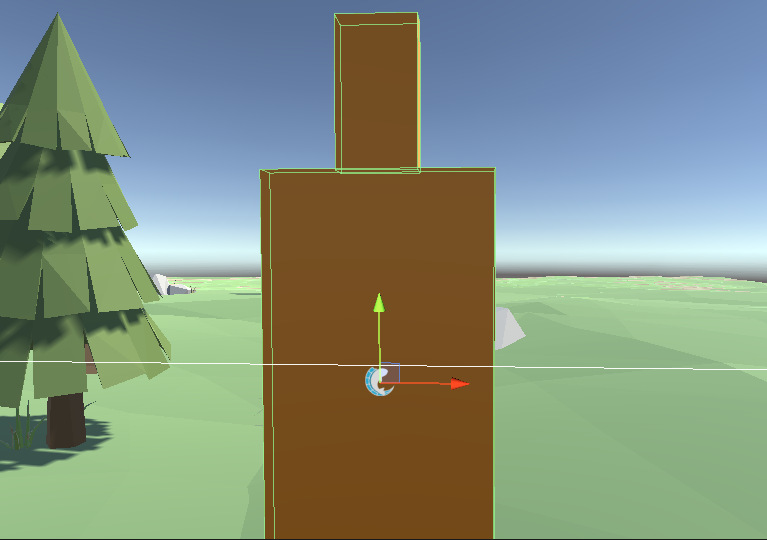
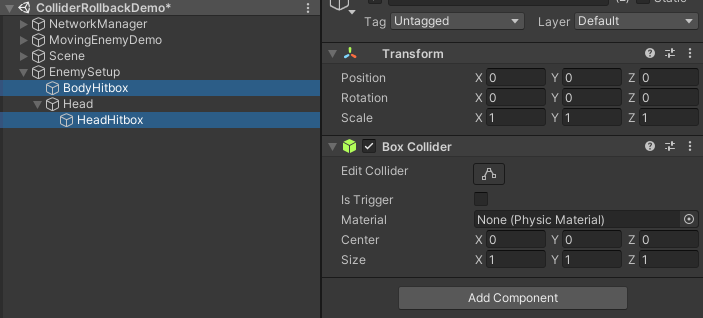
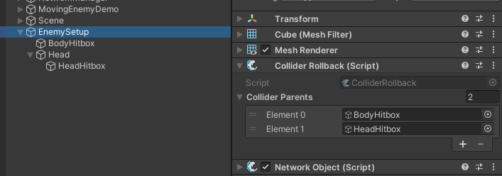

# Raycast


Fish-Networking [Pro](../../../overview/readme/pro-projects-and-support.md) is required for raycast lag compensation. Over-time projectiles may use another approach and do not require Pro. See [Projectiles ](projectiles.md)for more information.


This feature can be setup easily in a few steps.

To begin I am entering the ColliderRollbackDemo scene included with Fish-Networking Pro. You do not need to open the scene, but if you wish to follow along visually you may.

## Hitboxes

In my scene is an object named EnemySetup. The screen capture below shows two boxes on the 'enemy'. One for the body, and one for the head.

<figure><figcaption></figcaption></figure>

Each hitbox must be on a new object. Generally speaking, the hitbox would be a child of whichever component moves. With an actual humanoid rig, you would probably place the head collider on a child beneath the neck bone.

Notice the 'hitbox' objects are children of the moving component, and only have a collider on them. You may use any collider type.

<figure><figcaption></figcaption></figure>

Next the ColliderRollback script must be added somewhere within your prefab or object. For the sake of simplicity I have mine on the root, with the NetworkObject.

Once added, specify each object you added as a collider within the **Collider Parents** collection.


To make things easier, place the suffix 'Hitbox' on all your hitbox objects. You can then lock the inspector on your ColliderRollback object, search Hitbox, and quickly drag all entries in at once.


<figure><figcaption></figcaption></figure>

You've completed all the steps required for setting up an object.

## Rollback Manager

To utilize the lag compensation you must also add the RollbackManager script to your Networkmanager object. We have a section on the [RollbackManager ](../../../fishnet-building-blocks/components/managers/rollbackmanager-pro-feature.md)component to understand what each field does. Once you review the component settings we can move onto the code.

## Performing a Rollback

The RollbackManager must know how far back in time to place colliders to obtain accurate hit results. When your client is to fire their weapon you will want to gather the current PreciseTick and include it with your Fire RPC.

```csharp
[Client]
private void Fire()
{
    //Use LastPacketTick to get the best tick alignment.
    PreciseTick pt = base.TimeManager.GetPreciseTick(TickType.LastPacketTick);
    //Call fire on the server.
    ServerFire(pt);
}

[ServerRpc]
private void ServerFire(PreciseTick pt)
{
    //Rollback using the precise tick sent in.
    //Using Physics for 3d rolback, Physics3D for 2d rolback.
    //Both physics types can be used at once.
    base.RollbackManager.Rollback(pt, RollbackManager.PhysicsType.Physics, base.IsOwner);
    //Perform your raycast normally.
    RaycastHit hit;
    if (Physics.Raycast(transform.position, transform.forward, out hit)) { }
    //Return the colliders to their proper positions.
    base.RollbackManager.Return();
}
```
