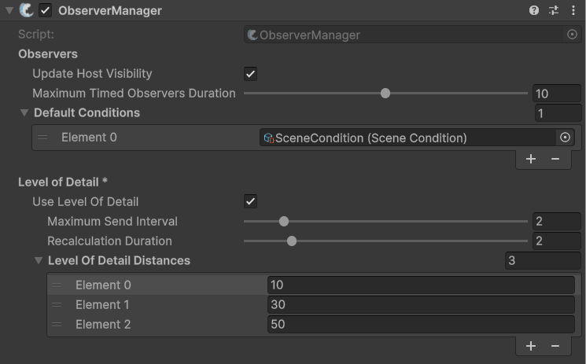

# Level of Detail (Pro Feature)

## What is LOD?

The Level of Detail (LOD) system is a Pro-tier optimization feature designed to reduce network traffic and improve client-side performance. By intelligently scaling the frequency of data synchronization based on the distance between non-owned objects and the client’s owned objects, the system ensures that nearby interactions remain precise while distant objects consume significantly fewer resources.

## Global configuration

The core logic for the LOD system is handled within the [ObserverManager](../../fishnet-building-blocks/components/managers/observermanager/). This is where you can enable the system and define the global "rules" for how updates are throttled.

You can read up more detail about each available option in the page about the [observermanager](../../fishnet-building-blocks/components/managers/observermanager/ "mention"). By setting your [Level of Detail Distances](../../fishnet-building-blocks/components/managers/observermanager/#level-of-detail-distances), you establish brackets for synchronization: objects within the **closest distance** sync at full speed, while those exceeding your furthest threshold sync at the [Maximum Send Interval](../../fishnet-building-blocks/components/managers/observermanager/#maximum-send-interval).

<figure><figcaption>
Example LOD values set in the <strong>ObserverManager</strong>
</figcaption></figure>

## Implementation and usage

**NetworkObject Settings**

The LOD system is opt-in at the NetworkObject level. On your NetworkObject component, you will find a [Use Level of Detail](../../fishnet-building-blocks/components/network-object.md#settings-1) toggle. When enabled, this specific object will adhere to globally defined distance rules.

**Prediction & Performance**

The LOD system prioritizes the optimization of Reconciles.

* Traffic Reduction: By sending fewer reconciles for distant objects, you significantly reduce the server's outgoing bandwidth.
* Client CPU Gains: Since the client doesn't have to process reconciles for every distant object every frame, local performance is improved.
* Movement Consistency: Replicates always continue to send regardless of LOD. This ensures that while an object might sync its state less frequently, it will never simply "stop" moving or disappear.

## Local state creation (Prediction Manager)

To prevent "popping" or desyncs when a client rapidly approaches a distant object, the system works in tandem with the [Prediction Manager’s Local State Creation](../../fishnet-building-blocks/components/managers/predictionmanager.md#create-local-states).

Even if the server hasn't yet recalculated the LOD for an object you just sprinted toward, the client will automatically begin reconciling nearby objects locally. This prevents physical desyncs—such as walking through an object—before the server's next scheduled LOD update. This feature is enabled by default and requires no additional setup.
