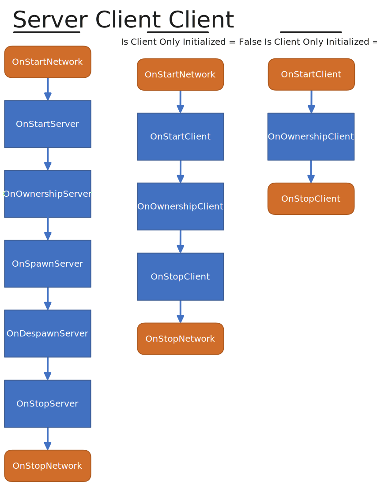

# NetworkBehaviour

When inheriting from [NetworkBehaviours ](../../../fishnet-building-blocks/components/network-behaviour-components.md)you are indicating that your script will utilize the network in some way. Once a NetworkBehaviour script is added to an object the [NetworkObject](../../../manual/guides/broken-reference/) component will automatically be attached.

NetworkBehaviours are essential for [Remote Procedure Calls](../network-communication/remote-procedure-calls.md), [Synchronizing](../network-communication/synchronizing/), and having access to vital network information.

***

## Properties <a href="#properties" id="properties"></a>

There are several public properties available within NetworkBehaviour, many of which you will use regularly. Most of the properties are only available after the object has been initialized. See the [callbacks](network-behaviour-guides.md#server-and-host-1) section for more information on initialization.

Commonly used properties are:

* **IsClientInitialized** will be true if acting as a client and object is network initialized.
* **IsServerInitialized** will be true if acting as the server and object is network initialized.
* **IsOwner** is true if you are a client, and the owner of the object.
* **HasAuthority** is true if you are the owner, or if server and there is no owner.

To view all properties please visit the [NetworkBehaviour API](https://fish-networking.com/FishNet/api/api/FishNet.Object.NetworkBehaviour.html#properties).


When accessing a NetworkBehaviour property or method consider using the 'base' keyword to show your intentions.

For example, base.IsOwner


***

## Callbacks <a href="#callbacks" id="callbacks"></a>




You do not need to include the base.XYZ() calls when implementing callbacks.


Like Properties, there are a large number of available methods. The methods you will be using commonly are known as callbacks. If you are interested in all available methods view the [methods section under API](https://fish-networking.com/FishNet/api/api/FishNet.Object.NetworkBehaviour.html#methods).

Most callbacks have a server and client version, and each has great potential. To use a callback you must inherit from NetworkBehaviour and override the callback you wish to use.

```csharp
// Example of implementing an override.
public override void OnStartServer()
{
    // This is run when the server initializes the object.
}
```

The execution order of spawn related callbacks is constant, but some callbacks may occur at any time. Included is a chart to help you remember callback order.


Unity Awake and OnEnable callbacks will always occur before any network activity.


<figure><picture><source srcset="../../../.gitbook/assets/network-behaviour-callbacks-dark.svg" media="(prefers-color-scheme: dark)"></picture><figcaption><p>Created by Winterbolt</p></figcaption></figure>

To begin we will cover the server side callbacks.

### **OnStartNetwork**

In some instances you will need to initialize for both server and client. You can save some code and time by using OnStartNetwork instead of the OnStart for Client and Server. It's important to remember that OnStartNetwork will only call once, even if you are clientHost.

```csharp
public override void OnStartNetwork()
{
    /* If you wish to check for ownership inside
    * this method do not use base.IsOwner, use
    * the code below instead. This difference exist
    * to support a clientHost condition. */
    if (base.Owner.IsLocalClient)
        SetupCamera();
}
```

### **OnStartServer**

```csharp
public override void OnStartServer()
{
    /* This callback is performed first. It occurs
    * when the object is initialized on the server.
    * Once called Owner, ObjectId, and much more are
    * already set.
    * OnStartServer is best used for initializing
    * server aspects of your script, such as getting
    * components only the server would need.
    * It can also be useful for setting values based on
    * the current state of your game. If you change synchronized
    * values within this method, such as SyncTypes,
    * those changes will be delivered to clients
    * when this object spawns for them.
    * Eg: perhaps you want to set a players name, which is
    * a SyncVar. You can do that here and it will be set
    * for clients when the object spawns on their side. */
    
    /* When using OnStartServer keep in mind that observers have
    * not yet been built for this object. If you were to send an ObserversRpc
    * for example it would not be delivered to any clients. You can however
    * still use an ObserversRpc and set BufferLast to true if you wish
    * clients to get it when the object is spawned for them. Another option
    * is to use OnSpawnServer, displayed below, and send a TargetRpc to the
    * connection which the object is spawning. */
}
```


When clientHost base.IsOwner will not return true, even with the owner set. This is because IsOwner is a client-side check, and the client has not yet initialized the object.

When you need to check 'IsOwner' on OnStartServer use **base.Owner.IsLocalClient**.


### **OnOwnershipServer**

```csharp
public override void OnOwnershipServer(NetworkConnection prevOwner)
{
    /* This is received when the server is giving ownership
    * to a client. If a client is gaining
    * ownership when the object is spawned OnOwnershipServer
    * will be called immediately after OnStartServer. prevOwner
    * is the connection which just lost ownership. If ownership is changed
    * at runtime this callback also occurs. */
}
```

### **OnSpawnServer**

```csharp
public override void OnSpawnServer(NetworkConnection connection)
{
    /* This callback occurs after a spawn message for this
    * object has been sent out to a client. For example: if
    * this object will be visible to five clients, then this
    * callback will occur five times, where the connection
    * parameter will be for each client. 
    * Primarily you will use this callback to send
    * tailored communications to the client
    * the object is being spawned for. */
}
```

### **OnDespawnServer**

```csharp
public override void OnDespawnServer(NetworkConnection connection)
{
    /* OnDespawnServer is similar to OnSpawnServer, except this is
    * called right before an object is despawned for a client.
    * This method can be used to send information to the client
    * before they receive the despawn message. You may even
    * send object orientated communications for this object
    * such as SyncTypes, and RPCs. */
}
```


When the server despawns a NetworkObject any pending synchronize changes will be sent out with the despawn message. This ensures clients will get the latest data, even if timed, before the object is despawned for them.


### **OnStopServer**

```csharp
public override void OnStopServer()
{
    /* This is the last callback for server side.
    * OnStopServer will be called immediately before
    * the object is deinitialized. At this time it is
    * too late to send communications specific to this
    * object for clients.
    * This callback may be used for any number of things but
    * could be useful for resetting synchronized values
    * such as SyncTypes when a scene object is despawned. */
}
```

Next are the client callbacks. These callbacks will always occur after the server callbacks, even when acting as host. For example, a callback sequence might look like this: OnStartServer, OnOwnershipServer, OnSpawnServer, OnStartClient, OnOwnershipClient.

For the most part client callbacks are the same as the server ones, except they occur only if the client connection is started. Only key differences will be included in the descriptions of each callback.

### **OnStartClient**

```csharp
public override void OnStartClient()
{
    /* This is called on each client when the object
    * becomes visible to them. Networked values such as
    * Owner, ObjectId, and SyncTypes will already be
    * synchronized prior to this callback. */
}
```


Any buffered remote procedure calls will occur immediately after OnStartClient.



If you are coming from Mirror instead of using OnLocalPlayer use OnStartClient with a base.IsOwner check.


### **OnOwnershipClient**

```csharp
public override void OnOwnershipClient(NetworkConnection prevOwner)
{
    /* Current owner can be found by using base.Owner. prevOwner
    * contains the connection which lost ownership. Value will be
    * -1 if there was no previous owner. */
}
```

### **OnStopClient**

```csharp
public override void OnStopClient()
{
    /* Like the server variant this is called right
    * before the object is deinitialized. It is too
    * late to send communications to the server
    * for this object after this callback has occurred. */
}
```

### **OnStopNetwork**

Like OnStartNetwork, this method can be used to save lines of code when needing to deinitialize for both server and client stop. OnStopNetwork will also only be called once even when clientHost.

```csharp
public override void OnStopNetwork()
{
    /* This will call after OnStopServer
    * and OnStopClient. */
}
```
