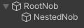

# Nested NetworkObjects

When a NetworkObject is beneath another NetworkObject it is considered nested. Fish-Networking allows you to nest NetworkObjects both in the scene and prefabs.

While spawning a root NetworkObject any active nested NetworkObjects will also be spawned. The nested NetworkObjects will experience the same callbacks as root, and share the same information such as IsOwner.

You may also have nested NetworkObjects deactivated in the scene or prefab and spawn them later.


When a nested NetworkObject is spawned after the root has already been spawned, the owner information is not automatically assumed the same as the root. You must specify if a client should gain ownership while calling Spawn.


Between instantiating the prefab and spawning the root NetworkObject you may make changes to nested NetworkObjects. This includes SyncTypes, and even the active state of the object. These changes are automatically synchronized when the root is spawned.

For example, if my prefab looks like this:



But I change the activate state of _NestedNob_ to disabled before server spawning as such:


RootNob will be spawned over the network with NestedNob disabled / not spawned.

```csharp
//An example of changing the enabled state for NestedNob.
public GameObject MyPrefab;

private void SpawnPrefab()
{
    GameObject go = Instantiate(MyPrefab);
    GameObject nestedNob = go.transform.GetChild(0);
    nestedNob.SetActive(false);
    //MyPrefab will spawn with NestedNob disabled for server and all clients
    //until you spawn it at a later time.
    base.Spawn(go);
}
```


Nested NetworkObjects may be spawned and despawned but they should not be detached. This feature is being examined for a future update.

There is an exception for nested scene NetworkObjects; they may be detached.

