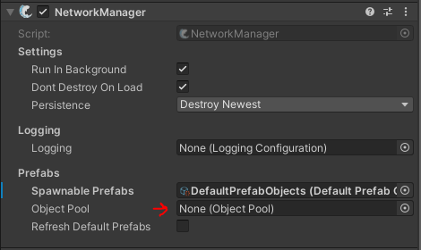
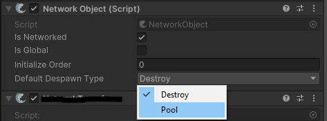

# Object Pooling

Fish-Networking has built-in functionality for Object pooling that will allow the server and client to keep instances of loaded prefabs in memory for later use. This could potentially provide better spawning performance for clients and server.

## General

When Despawning [Spawned NetworkObjects](../networkobjects/#spawned-networkobject) using FishNet, instead of destroying the object you may just want to disable it and store it to be used again at a later time. This describes what Object Pooling is.\
\
FishNet has a default implementation that will allow the objects you have instantiated to be disabled and pooled, instead of being destroyed. This functionality works for clients and server.\
\
You can also Pre-warm assets for later use, which is discussed later in this guide.


Reminder that [Scene NetworkObjects](../networkobjects/#scene-networkobject) do not get added to the Object Pool and are already disabled instead of destroyed when despawned.


## Setup

As mentioned on the [NetworkManager](../../../../fishnet-building-blocks/components/managers/network-manager.md) component page, there is an assignable field labeled _ObjectPoo&#x6C;**.**_ You may assign any script which inherits from the **ObjectPool** class.\
\
By Default when examining the NetworkManager in the Editor nothing will be assigned to this field, however when you enter play mode the NetworkManager will automatically populate it with the default implementation, and attach the script to the NetworkManager GameObject.

See below for screen captures of the NetworkManager.

<figure><figcaption><p>Editor Mode - Nothing will be assigned, unless you impliment your own Object Pool</p></figcaption></figure>

<figure><figcaption><p>Play Mode - Default Object Pool Automatically Assigned</p></figcaption></figure>


By default the object pool is enabled, but your network objects will only use the pool if the default despawn behavior is modified, or through the despawn call. See below for examples to both of these.


### Default Despawn Behavior

On the [NetworkObject](../../../../manual/guides/spawning/broken-reference/) component you can set what the default despawn behavior is for the object where the script is placed.\
\
This setting is set to "Destroy" by default, so make sure to switch this over to "Pool" if you want Fish-Networking to automatically use the default object pool.

<figure><figcaption></figcaption></figure>

### Manual Despawn Behavior

You can manually change the despawn behavior through code for specific situations.

```csharp
//When calling Fishnets Despawn from any location you can pass a enum 
//perameter to deviate from the default behavior.
ServerManager.Despawn(nob, DespawnType.Pool);
```

### Spawning NetworkObjects

When using the object pool you will want to retrieve NetworkObject from it prior to network spawning them. Doing so will pull from the pool rather than instantiate new objects.

```csharp
//There are many overrides which can a variety of information.
//You can use GameObjects, NetworkObjects, PrefabIds, CollectionIds,
//spawn positions, and more.
NetworkObject nob = NetworkManager.GetPooledInstantiated(...);
//Spawn normally.
ServerManager.Spawn(nob);
```

If you are certain you do not wish to use the object pool on a specific object you can still use the code above and simply set the Default Despawn Type to Destroy on the NetworkObject, or Instantiate and spawn normally.

## Pre-Warming the ObjectPool

If you want to manually store Network Objects to the ObjectPool prior to needing them at run-time you may do so through the NetworkManager API.

Here is a very basic implementation of pre-warming the ObjectPool.

```csharp
[SerializeField]
private NetworkObject _nobPrefab;

private void Start()
{
    /// <summary>
    /// Instantiates a number of objects and adds them to the pool.
    /// </summary>
    /// <param name="prefab">Prefab to cache.</param>
    /// <param name="count">Quantity to spawn.</param>
    /// <param name="asServer">True if storing prefabs for the server collection.</param>
    InstanceFinder.NetworkManager.CacheObjects(_nobPrefab, 100, IsServer);
}
```

## Custom Implementation

FishNet allows for the user to implement their own method of object pooling. First create your own class inheriting from the **ObjectPool** class. Place your new class component in your scene, typically directly on the NetworkManager object. Then assign your component to the _ObjectPool_ field on the NetworkManager.
