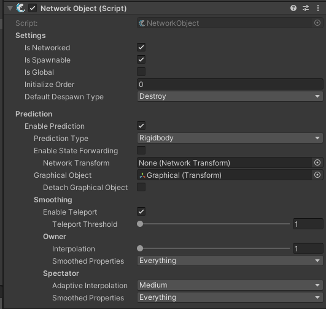

# Configuring NetworkObject

All of the current options for the NetworkObject inspector are shown below. There are many but many will not be seen depending on your setup, and most are just there to provide you more fine-tuning for your game or setup.

<figure><figcaption></figcaption></figure>

To begin you must first choose to Enable Prediction. Next you will set the Prediction Type. If you are using a rigidbody or rigidbody2D set the prediction type accordingly. Other is used for non-physics such as character controllers.

## State Forwarding

State forwarding will allow the same inputs to run on all clients as they do on the server. This can be useful if you want all clients and server to run the same input based logic, similar to if the client or server owns the object. State forwarding is more CPU intensive as it means a state buffer must be kept, and the object must reconcile to make corrections as well re-run past states.

Even with the overhead state forwarding is often the most preferred approach because of the fact you do gain the ability to run code identical to how the client and server ran it, resulting in a more reliable simulation and potentially easier coding approach.

When state forwarding is disabled only the owner and server will run the inputs, and only the owner will keep the buffer for objects they own. This also means you must forward any information to clients that is essential to them displaying actions on non-owned objects, such as using a NetworkAnimator to now relay animations, or using RPCs to send gun fire audio. Movement is also not forwarded, so you may want to attach a NetworkTransform and specify it within the NetworkTransform field. Specifying the NetworkTransform will simply try to configure it to prediction based on your other NetworkObject inspector settings. If you are finding this is causing issues you can simply leave the field empty.

## Graphical Object

This is the object which holds your graphics for the NetworkObject. By graphics, this means anything which holds visual representation that you would likely want smoothed between ticks, as well corrections from any potential de-synchronizations. It's very much worth mentioning you can leave this field empty and you will lose view additional options, such as Smoothing.

When using a graphical object it's very important to remember that you do not want any components on or beneath it that could negatively be affected by smoothing, such as a capsule to move your player. During a network tick prediction methods will run, and the TimeManager.TickDelta is used as the frame delta. Think of this as the same as if you were creating a client-authoritative physics controller while using FixedUpdate to move. Even as client-authoratitive, if you were to smooth the root the distance traveled during the FixedUpdate then your root would be in a different spot than where the physics engine left it. In result the movement and collision system wouldn't behave quite right. With all of that said, typically your colliders and triggers which affect gameplay or transforming the NetworkObject should be on the same GameObject as your NetworkObject. Or at the very least, not within the graphical object.

To understand more what this does read the component information [here](../../../fishnet-building-blocks/components/network-object.md). Detaching the graphical object is a supplemental feature which might be useful depending on your setup. The default is keeping the graphical a child, where it is. When this is true the graphical object rolls back to it's transform properties after the tick, then smooths to the transform properties it was after the tick. This is done so you can run lower tick rates and have smooth transform updates rather than everything stepping to whatever your tick rate delta is.

However, keeping the graphical object attached could be problematic for certain animation setups, or even cameras. Third party assets often do not expect transforms to teleport back and then be smooth to their destination over time, and in result you might see some funky outcomes of this action. Cameras as well can display what appears to be stuttering or jitter of your graphical object, even though it's completely fine. By detaching the graphical object it is no longer rolled back after the tick, and it simply exists in world space moving towards the proper goal over the duration of a tick. In most scenarios detaching would likely be better but there is always a chance it's not right for you, hence the default of staying attached.

## Smoothing

The smoothing options are only present when a graphical object is set. Most of these settings are explained well on the same NetworkObject component information page linked above.

There are certain cases where you may want to customize smoothing to control what is actually smoothed, versus what you want to control yourself. That's where the smoothed properties come in. You will notice there is a smoothed properties for if you are the owner of the object, or a spectator(not owner). In a number of cases we've seen developers wanting to self smooth things such as rotation while letting FishNet handle the position and scale. In such a scenario you would just untick rotation from the smoothed properties.

Changing the smoothing has absolutely no affect on the prediction itself, at least it shouldn't assuming you utilized the previous notes of graphical object.

Adaptive Interpolation under Spectator options determines the level of interpolation on spectated objects. Setting this to lower values ultimately means less interpolation, and in result a larger chance that a de-synchronization will be more apparent from a visual stand point. A higher value of course means more interpolation, and much less chance of seeing the effects of a de-synchronization. Whichever you use for this keep your game type in mind, or just play around with the settings under some latency until you see what you like. The adaptive interpolation API is also exposed letting you tweak it at runtime, and we have components that do just this to help you get that perfect feel for your game.
