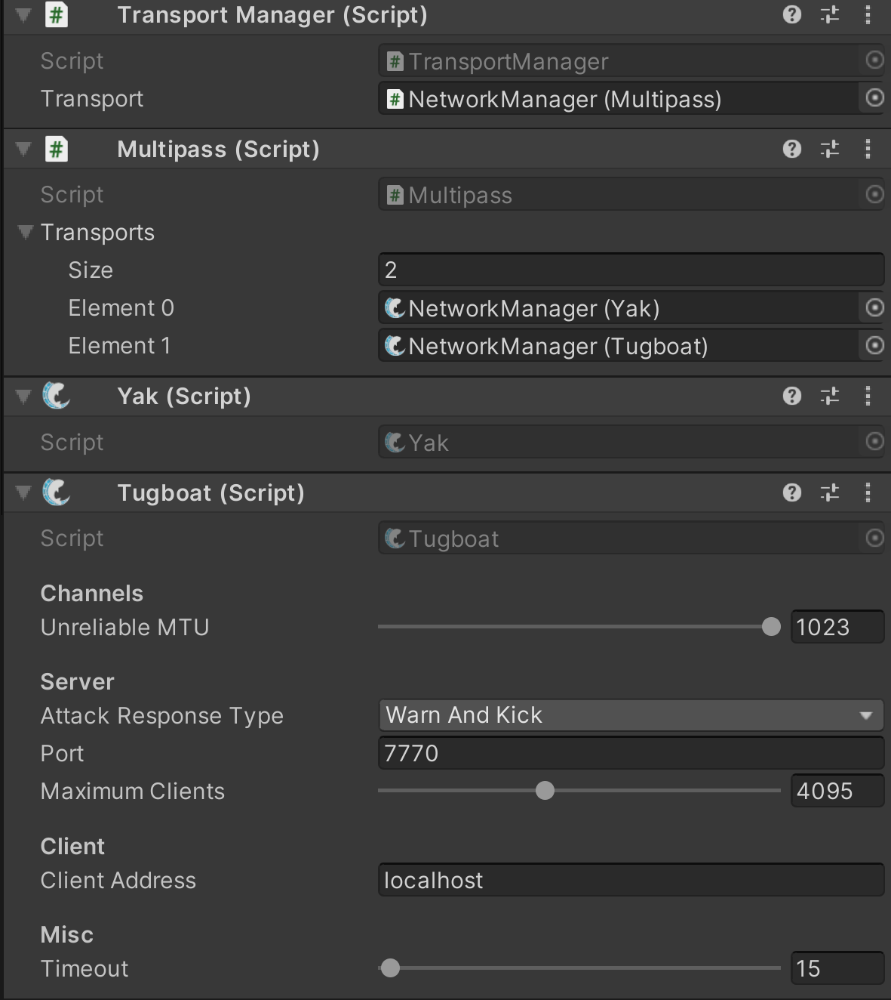

---
layout:
  title:
    visible: true
  description:
    visible: false
  tableOfContents:
    visible: true
  outline:
    visible: true
  pagination:
    visible: true
---

# Multipass


You may want to access specific transports directly. You can do so by getting a reference to Multipass and calling multipassReference.GetTransport\<Type>().

The Transports collection is also publicly accessible within Multipass.


## Setup <a href="#guide-setup" id="guide-setup"></a>

Like other transports to use Multipass it must be added to a gameObject, generally your NetworkManager object. After adding Multipass you must assign it as the transport to use within [TransportManager](../../../fishnet-building-blocks/components/managers/transportmanager/). If TransportManager is not added to your NetworkManager automatically; you may need to add the component first. Once Multipass is added and specified in your TransportManager add whichever other transports you wish to support. Drag the added reference of each transport to **Transports** under Multipass.


Be sure that each transport within Multipass is listening on a different port.




## Client

A client may only use one transport within Multipass, while the server may listen on all the transports at once.

For client actions to work you must specify which transport to use for the client.

```csharp
//This can be done easily using the TransportManager.
Multipass mp = transportManager.GetTransport<Multipass>();

//In this example if the build is a webGL build
//then use Bayou, otherwise use Tugboat.

#if UNITY_WEBGL && !UNITY_EDITOR
mp.SetClientTransport<Bayou>();
#else
mp.SetClientTransport<Tugboat>();
#endif
```

The example above shows using Bayou and Tugboat, but you may of course use your own logic for any number of transports.

Once a client transport is set you may perform functions normally as if you were using only one transport. An example of this would be: ClientManager.StartConnection().

## Server

As covered in the [component settings](../../../fishnet-building-blocks/transports/multipass.md#component-settings) _GlobalServerActions_ will execute server actions on all transports specified within Multipass. If you were to call ServerManager.StartConnection() while _GlobalServerActions_ is true then the server would start on all transports; otherwise an error will be thrown.

```csharp
//Start all servers transports. This requires GlobalServerActions to be true.
serverManagerReference.StartConnection();
```

You may also access functions on a single transport by specifying the index of which transport to use.

```csharp
//Start the connection on index 0.
Multipass mp = TransportManager.GetTransport<Multipass>();
//The true parameter is to indicate you are starting a server.
mp.StartConnection(true, 0);
```
